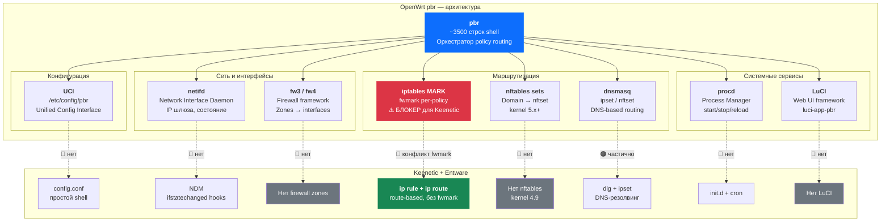

# Исследование: готовые альтернативы geo-split для Entware/Keenetic

**Дата**: 2026-04-09  
**Контекст**: Поиск готовых пакетов / решений для селективной GEO-маршрутизации на Keenetic с Entware

## Вопрос

Существует ли готовый пакет для Entware (типа `opkg install geo-routing`), который делает то же самое, что наш `geo-split`?

## Что делает geo-split

Селективная маршрутизация GEO IP-подсетей — через ISP напрямую (в обход VPN) или через VPN-туннель. Ключевые особенности:

- **Route-based подход** — без iptables mangle/fwmark (совместим с Keenetic NDM)
- **`ip rule iif br0 table 1000`** + per-subnet маршруты (~13K для RU)
- **NDM hooks** — реакция на interface up/down  
- **Async-данные** — cron обновляет кэш CIDR-списков + DNS-резолвинг доменов
- **Мгновенный старт** — `ip-full -batch` загружает 13K маршрутов за ~1 сек

## Что есть в Entware из «кирпичиков»

В стандартном репозитории Entware доступны инструменты, но **не оркестратор**:

| Пакет | Что делает |
|-------|-----------|
| `ip-full` | `ip rule`, `ip route`, `-batch` режим |
| `ipset` | hash:net множества для CIDR |
| `curl` / `wget` | загрузка списков |
| `bind-dig` | резолвинг доменов |
| `jq` | парсинг RIPE JSON |
| `cron` | периодические обновления |

**Готового пакета-оркестратора для GEO-маршрутизации в Entware нет.**

## Существующие community-проекты

### 1. ruantiblock (Keenetic)

- **Репо**: `DennoN-RUS/ruantiblock`
- **Задача**: обход блокировок РКН через VPN/прокси
- **Подход**: `iptables MARK` + `ipset` + dnsmasq
- ⚠️ **Проблема**: использует `fwmark`, что конфликтует с Keenetic NDM per-device routing
- Подробнее о конфликте: [keenetic-fwmark-analysis.md](../../docs/keenetic-fwmark-analysis.md)

### 2. zapret (bol-van)

- **Репо**: `bol-van/zapret`
- **Задача**: обход DPI (Deep Packet Inspection), **не маршрутизация**
- **Подход**: `nfqueue` / `iptables` + пакетная модификация (TTL, TCP segmentation)
- Это принципиально другая задача — обход DPI, а не geo-routing

### 3. antizapret / antifilter

- **Задача**: поддержка актуальных списков заблокированных IP/доменов РФ
- Предоставляют только **данные** (списки), не routing-логику
- Можно использовать как source URL для `geo-split`

### 4. pbr — Policy Based Routing (OpenWrt)

- **Пакет**: `luci-app-pbr` (ранее `vpn-policy-routing`)  
- **Автор**: stangri
- **Задача**: полноценный policy-based routing с Web UI
- **Платформа**: **только OpenWrt**, на Keenetic с Entware не работает
- Подробный анализ адаптации — см. раздел ниже

### 5. Keenetic встроенный policy routing

- Через Web UI: «Приоритеты подключений» → per-device / per-domain routing
- **Ограничения**: нельзя роутить по CIDR-спискам (13K+ подсетей), только по доменам или устройствам

## Почему нет готового пакета

1. **Keenetic-специфика** — NDM hooks, конфликты fwmark, специфика интерфейсов (br0, nwg0, ovpn_br*) — всё уникально для Keenetic
2. **Нет единого сценария** — bypass VPN для RU, force VPN для RU, разные страны/списки
3. **Entware ≠ OpenWrt** — в OpenWrt есть `pbr` с LuCI, но Entware — дополнение к проприетарной прошивке, а не полноценная ОС роутера

---

## Анализ: адаптация OpenWrt `pbr` к Keenetic

### Что такое `pbr`

[pbr](https://github.com/stangri/pbr) — пакет для OpenWrt (~3500 строк shell + ~2000 строк LuCI), позволяющий маршрутизировать трафик по правилам (источник, назначение, домен, порт) через разные WAN-интерфейсы.

### Архитектура `pbr` и зависимости от OpenWrt



**Легенда**: 🔴 = отсутствует на Keenetic, требует полной замены | 🟠 = частично совместимо

| Компонент | Что делает в `pbr` | Замена на Keenetic | Объём работы |
|-----------|--------------------|--------------------|-------------|
| **UCI** (`/etc/config/pbr`) | Хранение всех настроек | Нет UCI → свой конфиг-формат | 🔴 Переписать парсер |
| **netifd** | IP шлюза, состояние интерфейса | NDM + `ip route` | 🔴 Переписать все `network.*` вызовы |
| **procd** | Запуск/остановка сервиса, reload | init.d + NDM hooks | 🔴 Переписать service management |
| **fw3/fw4** | Firewall zones → interface mapping | Нет zones | 🔴 Переписать определение интерфейсов |
| **iptables MARK** | fwmark для policy routing | **Несовместимо с Keenetic NDM** | 🔴 **Фундаментальный блокер** |
| **nftables sets** | Domain → nftset для routing по доменам | Нет nftables на Keenetic (kernel 4.9) | 🔴 Переписать на ipset + dig |
| **dnsmasq ipset** | Интеграция domain routing | dnsmasq не под нашим контролем | 🟠 Возможно через отдельный DNS |
| **LuCI** | Web UI | Keenetic Web UI | 🔴 Не переносимо |

### Фундаментальный блокер: fwmark

`pbr` полностью построен на fwmark:

```sh
iptables -t mangle -A PREROUTING ... -j MARK --set-xmark 0x010000/0xff0000
ip rule add fwmark 0x010000/0xff0000 table 254
```

Как документировано в [keenetic-fwmark-analysis.md](../../docs/keenetic-fwmark-analysis.md):

> iptables mangle MARK фундаментально несовместим с per-device routing Keenetic — 
> оба механизма используют одно и то же поле `skb->mark`, а Keenetic делает exact 
> full-match в `ip rule`.

Наш `geo-split` использует route-based подход (без fwmark) именно потому, что fwmark ломает Keenetic NDM. Адаптация `pbr` потребовала бы полной переделки его routing-механизма.

### Количественная оценка

| Метрика | Адаптация `pbr` | Наш `geo-split` |
|---------|----------------|-------------------|
| Строк кода для замены | ~3000 из ~3500 (86%) | уже работает |
| Зависимостей для замены | 7 компонентов | 0 |
| Фундаментальных конфликтов | 1 (fwmark) | 0 |
| Оценка времени | 2–4 недели | уже готово |
| Доп. возможности сверх geo-split | per-port, per-source IP routing | редко нужно |

### Что `pbr` умеет, а `geo-split` — нет

1. **Per-source IP routing** — направить конкретное устройство в конкретный WAN  
   → Keenetic делает это встроенно через Web UI
2. **Per-port routing** — порт 80 через VPN, 443 через ISP  
   → Очень редкий сценарий для домашнего роутера
3. **Per-domain routing** через dnsmasq nftset  
   → Частично реализовано в `geo-split` через `dig` + ipset
4. **Web UI** (LuCI)  
   → Отдельная задача, не зависящая от `pbr`

---

## Сравнение: geo-split vs альтернативы

| Аспект | geo-split | ruantiblock | OpenWrt `pbr` | Keenetic встроенный |
|--------|-----------|-------------|---------------|-------------------|
| Платформа | Keenetic + Entware | Keenetic | OpenWrt | Keenetic firmware |
| Routing метод | route-based (ip rule + routes) | iptables MARK | iptables MARK / nftables | Firmware policy |
| Keenetic NDM совместимость | ✅ | ❌ (fwmark конфликт) | N/A | ✅ |
| GEO CIDR (13K+) | ✅ | ✅ | нет встроенных | ❌ |
| DNS-based домены | ✅ (dig + ipset) | ✅ (dnsmasq) | ✅ (dnsmasq nftset) | ✅ (ограниченно) |
| Per-device routing | — | — | ✅ | ✅ |
| NDM hooks | ✅ | — | N/A | встроенно |
| Web UI | — | — | LuCI | да |
| Установка | `install.sh` | скрипты | `opkg install` | встроенно |

## Заключение

1. **Готового пакета для Entware нет** — в `opkg` отсутствует аналог geo-split
2. **Адаптация `pbr` нецелесообразна** — 86% кода нужно переписать, fwmark фундаментально несовместим с Keenetic
3. **`geo-split` архитектурно правильнее** для Keenetic, чем любое существующее решение, потому что:
   - Route-based подход без конфликтов с NDM
   - NDM hooks для реакции на интерфейсы
   - Минимальные зависимости (только Entware `ip-full`)
4. **При необходимости расширения** (per-device, per-domain) — проще добавлять фичи в `geo-split`, чем портировать чужое решение с несовместимой архитектурой
