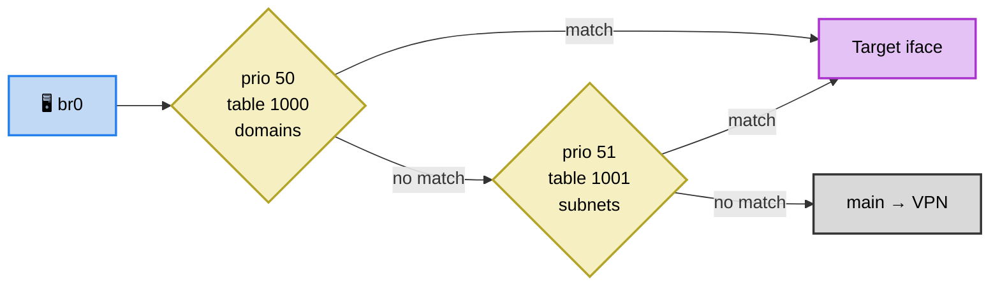

# Разделение route tables + async reload

**Version:** v1.3 | **Created:** 2026-04-12 | **Status:** ✅ Done

## Update History

| Date | Version | Changes |
|------|---------|---------|
| 2026-04-12 | v1.3 | Упрощение: без flock/route replace, consistency check |
| 2026-04-12 | v1.2 | Robustness: flush on DOWN, last-known-good |
| 2026-04-12 | v1.1 | Уточнение: порядок таблиц, отвязка от dev |
| 2026-04-12 | v1.0 | Первичный анализ |

---

## Проблема

`attach-rules.sh` — монолит: resolve iface + ip rules + flush ALL + load ALL.
Domain update (hourly) перезагружает ~11K subnet routes (~1с disruption).

## Целевая архитектура

Routing tables — shared state. Загрузчики пишут в свои таблицы, ip rules подключают LAN.

```
PRODUCERS (каждый владеет своей таблицей):
  update-domains.sh  → resolve DNS + flush+fill table 1000 (dev $TARGET_IFACE)
  update-subnets.sh  → download   + flush+fill table 1001 (dev $TARGET_IFACE)

CONSUMERS (ip rules):
  attach-rules.sh  → ip rule add iif br0 table 1000 prio 50
                      ip rule add iif br0 table 1001 prio 51
  detach-rules.sh  → ip rule del + flush tables
```

Таблицы: custom first, broad second:

| Table | Prio | Source | Записей |
|-------|------|--------|---------|
| 1000 | 50 | domains (/32) | ~175 |
| 1001 | 51 | subnets (CIDR) | ~11K |
| 1002+ | 52+ | (future lists) | — |



## Async

Загрузчики пишут в РАЗНЫЕ таблицы → безопасно параллельно, lock не нужен:

```sh
# S99geo-split start:
"$SCRIPTS/update-subnets.sh" &
"$SCRIPTS/update-domains.sh" &
wait
"$SCRIPTS/attach-rules.sh"
```

Редкий race (cron + NDM hook одновременно на одну таблицу) — самоисцеляется за 15 мин cron.

## Жизненные циклы

| Событие | Действие |
|---------|----------|
| `start` | update-subnets ‖ update-domains, затем attach-rules |
| `stop` | detach-rules (del rules + flush tables) |
| cron `refresh` | update-subnets ‖ update-domains. Без ip rules. |
| `update-subnets` | force download → fill table 1001 |
| `update-domains` | force resolve → fill table 1000 |
| `update` | force both |
| **NDM UP** | fill tables + attach-rules |
| **NDM DOWN** | detach-rules (del rules + flush tables) |

NDM DOWN flush-ит таблицы: чистое состояние, маршруты с `dev old_iface` бесполезны.
NDM UP fill-ит таблицы: resolve актуальный dev, заполнить таблицы, подключить ip rules.

## Робастность (без overeng)

| Риск | Решение |
|------|---------|
| DNS/download fail | Не перезаписывать кэш при ошибке (last-known-good). Subnets: уже есть `count < 100` check. Domains: добавить аналогичный. |
| Boot race (interface not UP) | Graceful skip: если `resolve_target_interface` fail → table fill пропускается, NDM hook UP подхватит. |
| Missing cache (first boot) | Graceful skip + log: `if [ ! -f "$cache" ]; then return 0; fi` |
| Interface flapping | NDM UP в background с `sleep 2` debounce. |

## План реализации

### 1. config.sh
```sh
DOMAIN_ROUTE_TABLE="1000"
DOMAIN_RULE_PRIORITY="50"
SUBNET_ROUTE_TABLE="1001"    # rename from ROUTE_TABLE
SUBNET_RULE_PRIORITY="51"    # rename from RULE_PRIORITY
```

### 2. lib/ip.sh
- Перенести `resolve_target_interface()` из attach-rules.sh
- Новая: `fill_routes_batch <table> <file> <dev>` — flush + ip-full -batch (или BusyBox loop)

### 3. update-subnets.sh
- После download → resolve iface → `fill_routes_batch $SUBNET_ROUTE_TABLE $SUBNET_LIST_FILE $dev`
- `--refill`: только fill из кэша (для NDM hook, без download)
- Exit: 0 = updated, 10 = fresh

### 4. update-domains.sh
- После resolve DNS → resolve iface → `fill_routes_batch $DOMAIN_ROUTE_TABLE $DOMAINS_CACHE_FILE $dev`
- `--refill`: только fill из кэша (для NDM hook, без resolve)
- Добавить min count check (≥ 5 IPs)
- Exit: 0 = updated, 10 = fresh

### 5. attach-rules.sh → только ip rules
- Для каждого iface в ROUTE_IN:
  - `ip rule del`/`add` table `$DOMAIN_ROUTE_TABLE` prio `$DOMAIN_RULE_PRIORITY`
  - `ip rule del`/`add` table `$SUBNET_ROUTE_TABLE` prio `$SUBNET_RULE_PRIORITY`

### 6. detach-rules.sh → ip rules + flush
- `ip rule del` для обеих таблиц
- `ip route flush table $DOMAIN_ROUTE_TABLE`
- `ip route flush table $SUBNET_ROUTE_TABLE`

### 7. S99geo-split
```sh
start)
  "$SCRIPTS/update-subnets.sh" &
  "$SCRIPTS/update-domains.sh" &
  wait
  "$SCRIPTS/attach-rules.sh"
  ;;
stop)
  "$SCRIPTS/detach-rules.sh"
  ;;
restart)
  "$0" stop; sleep 1; "$0" start
  ;;
refresh)                        # cron
  "$SCRIPTS/update-subnets.sh" &
  "$SCRIPTS/update-domains.sh" &
  wait
  ;;
update)
  "$SCRIPTS/update-subnets.sh" --force &
  "$SCRIPTS/update-domains.sh" --force &
  wait
  ;;
update-subnets)
  "$SCRIPTS/update-subnets.sh" --force
  ;;
update-domains)
  "$SCRIPTS/update-domains.sh" --force
  ;;
```

### 8. ndm-hook.sh
Обновить eval на новые имена:
```sh
eval "$(grep -E '^(ROUTE_OUT|DOMAIN_ROUTE_TABLE|SUBNET_ROUTE_TABLE|ROUTE_IN)=' "$CONFIG")"
```

На DOWN проверять обе таблицы (текущий код проверяет одну `ROUTE_TABLE`):
```sh
yes-up-up)
  # auto mode: только если у интерфейса default route
  if [ -z "$TARGET_IFACE" ]; then
    ip route show default | grep -q "dev ${system_name:-}" || exit 0
  fi
  {
    sleep 2  # debounce
    "$HOOK_DIR/update-subnets.sh" --refill &
    "$HOOK_DIR/update-domains.sh" --refill &
    wait
    "$HOOK_DIR/attach-rules.sh"
  } &
  ;;
no-down-*)
  # auto mode: проверить обе таблицы
  if [ -z "$TARGET_IFACE" ]; then
    has_routes=0
    ip route show table "$SUBNET_ROUTE_TABLE" 2>/dev/null | grep -q "dev ${system_name:-}" && has_routes=1
    ip route show table "$DOMAIN_ROUTE_TABLE" 2>/dev/null | grep -q "dev ${system_name:-}" && has_routes=1
    [ "$has_routes" -eq 1 ] || exit 0
  fi
  "$HOOK_DIR/detach-rules.sh"
  ;;
```

### 9. status.sh
- `Domains: N in table 1000 ✓` / `Subnets: M in table 1001 ✓`
- ip rule для каждой таблицы отдельно
