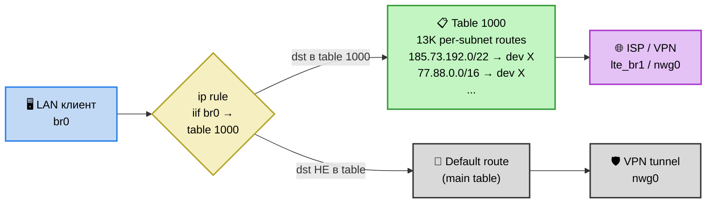
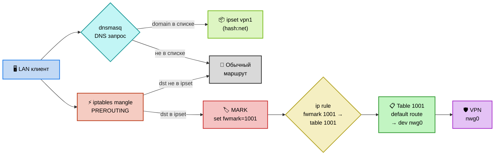
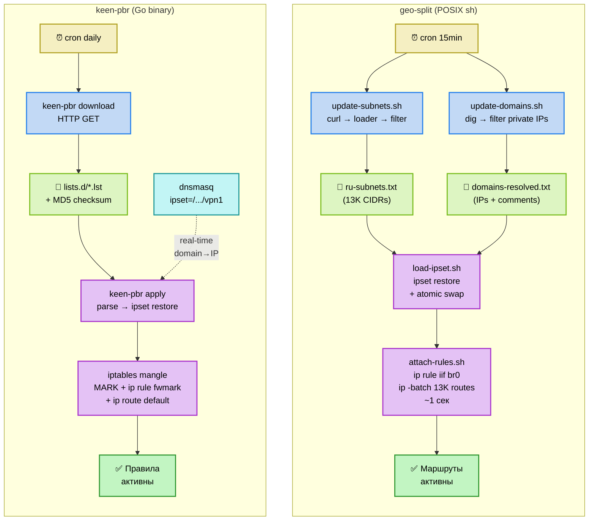

# Глубокое сравнение: geo-split vs keen-pbr

**Дата**: 2026-04-11  
**keen-pbr**: v2.2.2 ([maksimkurb/keen-pbr](https://github.com/maksimkurb/keen-pbr))  
**geo-split**: v0.1.0 (local)

---

## 1. Обзор проектов

| | **geo-split** | **keen-pbr** |
|---|---|---|
| **Назначение** | Селективная GEO-маршрутизация (целые страновые подсети) | Policy-based routing (per-domain, per-IP, per-list) |
| **Язык** | POSIX sh (~1200 строк) | Go (~3700 строк) + sh (~150 строк) |
| **Тесты** | shellcheck | Go unit tests (~5000 строк) |
| **Версия** | 0.1.0 | 2.2.2 |
| **Конфиг** | `config.sh` (shell vars) | `keen-pbr.conf` (TOML) |
| **Платформа** | Keenetic + Entware | Keenetic + Entware |
| **Лицензия** | нет (private) | MIT |
| **Сообщество** | 1 автор | GitHub + Telegram чат |
| **CI/CD** | нет | GitHub Actions (multi-arch build) |
| **opkg-репо** | нет (ручная сборка .ipk) | Собственный opkg-репозиторий |

---

## 2. Архитектура маршрутизации (КРИТИЧЕСКОЕ отличие)

### Схема: geo-split (route-based)



> **Ключевое**: `skb->mark` не затрагивается → NDM per-device routing работает. HW NAT сохранён.

### Схема: keen-pbr (fwmark-based)



> **Ключевое**: `skb->mark` перезаписывается → конфликт с NDM per-device routing. HW NAT отключён.

### Различие роли ipset

| | **geo-split** | **keen-pbr** |
|---|---|---|
| **Роль ipset** | Вспомогательное хранилище (для `status.sh` диагностики) | **Ядро маршрутизации** (`iptables -m set --match-set`) |
| **Используется в routing path?** | ❌ Нет — routing через per-subnet routes в table 1000 | ✅ Да — ipset match → fwmark → table |
| **Что содержит** | Те же подсети, что и в route table (зеркало) | IP/CIDR из списков + domain IPs от dnsmasq |
| **Если удалить ipset** | Маршрутизация продолжит работать | Маршрутизация **полностью сломается** |

### geo-split: route-based (без fwmark)

```
ip rule add iif br0 table 1000 priority 50
ip route add 185.73.192.0/22 dev lte_br1 table 1000   # ×13K routes
```

**Механизм**: Per-subnet маршруты в custom table. Весь LAN-трафик (iif br0) проверяется по table 1000. Если destination попадает в маршрут — идёт через target interface. Если нет — проходит дальше по default route.

**Плюсы**:
- ✅ **Совместим с Keenetic NDM per-device routing** — не трогает `skb->mark`
- ✅ Нет зависимости от iptables/netfilter
- ✅ HW NAT может оставаться включённым
- ✅ Нет конфликта с другими fwmark-решениями

**Минусы**:
- ❌ Per-subnet маршруты (~13K) занимают память kernel route table
- ❌ Нет per-domain routing через маршруты (компенсируется dig + ipset + /32 routes)
- ❌ Невозможно маршрутизировать per-source IP через `iif`

### keen-pbr: fwmark-based (iptables mangle)

```
iptables -t mangle -A PREROUTING -m set --match-set vpn1 dst -j MARK --set-mark 1001
ip rule add fwmark 1001 table 1001 priority 1001
ip route add default dev nwg0 table 1001
```

**Механизм**: IP/домены → ipset → iptables MARK → ip rule fwmark → custom table с default route через VPN.

**Плюсы**:
- ✅ Только 1 default route в таблице (не 13K routes)
- ✅ Эффективный per-domain routing через dnsmasq ipset
- ✅ Поддерживает множество ipset-ов с разными интерфейсами
- ✅ Kill switch (blackhole route)

**Минусы**:
- ❌ **fwmark конфликтует с Keenetic NDM** per-device routing (оба используют `skb->mark`)
- ❌ Требует отключения HW NAT (`disable_hwnat` в init script)
- ❌ Зависимость от iptables/netfilter kernel modules
- ❌ Требует компонент «Модули ядра подсистемы Netfilter»

### Последствия fwmark-подхода keen-pbr

В `S80keen-pbr` при start выполняется `disable_hwnat`:
```sh
sysctl -w net.netfilter.nf_conntrack_fastnat=0
```
Это **отключает аппаратное ускорение NAT** для всей сети, что может снизить throughput роутера. geo-split этого не требует.

---

## 3. Domain routing

| | **geo-split** | **keen-pbr** |
|---|---|---|
| **Механизм** | `dig` → ipset + /32 routes | `dnsmasq` ipset integration |
| **Момент резолва** | Cron (периодический) | При DNS-запросе клиента (real-time) |
| **Отдельный DNS** | SmartDNS (автодетект порта 6153/6053) | dnsmasq (подменяет конфиг) |
| **Новые IP домена** | Подхватываются при следующем cron-цикле | Подхватываются мгновенно при DNS-запросе |
| **Приватные IP** | Фильтруются (10.x, 172.16-31.x, 192.168.x) | Не фильтруются |
| **@include в списках** | Да (lib/lists.sh) | Нет (только flat lists) |

**keen-pbr** здесь сильнее: dnsmasq-интеграция даёт **мгновенный** domain routing при первом же DNS-запросе. geo-split опирается на cron (15 мин) + dig, что создаёт задержку для новых IP.

Однако geo-split **не подменяет dnsmasq**, а использует отдельный `dig` — что безопаснее в плане «не сломать DNS на роутере».

⚠️ **Риск keen-pbr**: при установке `postinst` **заменяет** `/opt/etc/dnsmasq.conf` на свою версию (оригинал → `dnsmasq.conf.orig`). Если у пользователя кастомизированный dnsmasq.conf (например, интеграция со SmartDNS) — keen-pbr его перезапишет. При удалении keen-pbr восстановление `.orig` может потерять промежуточные изменения.

---

## 4. Конфигурация

### geo-split: shell variables

```sh
ROUTE_MODE="auto"           # bypass | vpn | auto
ISP_INTERFACE=""            # auto-detect
VPN_INTERFACE="nwg0"
IPSET_NAME="geo-split"
ROUTE_TABLE="1000"
SUBNET_URL="https://www.ipdeny.com/ipblocks/data/countries/ru.zone"
SUBNET_LOADER="cidr-plain"
DOMAINS_LIST_FILE="$_LISTS_DIR/domains.txt"
```

**Плюсы**: Простота, прозрачность, sourceable из любого скрипта.  
**Минусы**: Нет валидации, нет структурированных данных, один ipset.

### keen-pbr: TOML

```toml
[[ipset]]
  ipset_name = "vpn1"
  lists = ["epic-games", "local"]
  ip_version = 4
  [ipset.routing]
    interfaces = ["nwg0", "nwg1"]
    fwmark = 1001
    table = 1001
    kill_switch = false

[[list]]
  list_name = "epic-games"
  url = "https://..."
```

**Плюсы**: Структурированный TOML, множество ipset-ов, валидация через `config/validator.go`, upgrade конфига между версиями.  
**Минусы**: Требует бинарный keen-pbr для парсинга.

---

## 5. Интеграция с Keenetic

| | **geo-split** | **keen-pbr** |
|---|---|---|
| **NDM ifstatechanged** | ✅ `ndm-hook.sh` (symlink) | ✅ `50-keen-pbr-routing.sh` |
| **NDM netfilter** | ❌ Не используется (route-based) | ✅ `50-keen-pbr-fwmarks.sh` (iptables) |
| **Keenetic RCI API** | ❌ Не используется | ✅ HTTP API: interface status, DNS proxy config |
| **Interface failover** | ✅ В NDM hook: auto-mode + re-attach | ✅ `ChooseBestInterface` (с RCI API) |
| **HW NAT** | Не трогает | Принудительно отключает |
| **DNS Override** | Нет | ✅ `override_dns` per-ipset |

keen-pbr глубже интегрирован с Keenetic через RCI API (`http://localhost:79/rci/show/interface`). Это позволяет проверять не только UP/DOWN интерфейса, но и наличие сетевого соединения через Keenetic.

geo-split использует стандартные `ip route show default` / `ip -o link show up` — проще, но менее точно.

### Boot order: S80 vs S99

- **keen-pbr**: S80 (ранний старт) — интерфейсы могут быть ещё не ready → компенсируется через два NDM hooks (netfilter.d + ifstatechanged.d пересоздают правила)
- **geo-split**: S99 (последний старт) — все интерфейсы гарантированно up → сразу рабочий маршрут, но окно ~1-3 сек при boot без маршрутов

---

## 6. Data pipeline

### Схема: сравнение data pipeline



### geo-split

```
[cron 15min]
  → update-subnets.sh → loader (curl + filter) → ru-subnets.txt (13K CIDRs)
  → update-domains.sh → dig → domains-resolved.txt (IPs)

[S99geo-split start]
  → load-ipset.sh → ipset restore + atomic swap (tmp → main)
  → attach-rules.sh → ip rule + ip -batch (13K routes, ~1s)
```

**Особенности**:
- Atomic swap ipset (zero-downtime)
- `ip-full -batch` для массовой загрузки маршрутов (~1 сек для 13K)
- Multi-interface failover при загрузке (DOWNLOAD_INTERFACES с глобами)
- Кэширование последнего удачного interface
- PID lock для предотвращения параллельного запуска
- Validation минимального размера (≥100 строк) — защита от пустых/битых ответов

### keen-pbr

```
[keen-pbr download]   → HTTP GET → lists.d/*.lst (файлы, с MD5 checksums)
[keen-pbr apply]      → parse lists → ipset restore (batch) + ip rule + ip route + iptables
[S80keen-pbr start]   → disable_hwnat → keen-pbr apply
[cron daily]          → download + apply
```

**Особенности**:
- MD5 checksum для пропуска неизменённых списков
- Поддержка IPv6 (dual stack)
- Multiple ipsets с разными interfaces
- Buffered ipset writer через Go pipe
- Config upgrade mechanism между версиями
- Нет multi-interface failover, retry, size validation при загрузке

### Масштаб данных

| | **geo-split** | **keen-pbr** |
|---|---|---|
| **Типичный объём** | 13K+ CIDR (целая страна) | Десятки-сотни записей (per-service) |
| **Route table** | 13K per-subnet routes | 1 default route на ipset |
| **Загрузка маршрутов** | `ip-full -batch` (~1 сек для 13K) | `netlink.RouteAdd()` (1 вызов) |
| **ipset restore** | 13K entries (~2 сек) | Десятки-сотни entries (~мгновенно) |

keen-pbr не тестировался на 13K+ записях — другой use case. geo-split оптимизирован именно для country-level объёмов.

---

## 7. Что есть в keen-pbr, чего нет в geo-split

| Фича | Сложность добавления |
|-------|-----------------|
| **Multiple ipsets** (разные списки → разные VPN) | 🟡 Средняя |
| **Kill switch** (blackhole route при падении VPN) | 🟢 Простая |
| **IPv6 support** | 🟡 Средняя |
| **DNS override** per-ipset | 🟡 Средняя |
| **dnsmasq integration** (мгновенный domain routing) | 🔴 Сложная (архитектурное изменение) |
| **Keenetic RCI API** (interface health check) | 🟡 Средняя |
| **TOML config** | 🔵 Не нужна (противоречит target-arch) |
| **Custom iptables rules** per-ipset | 🔴 Не нужна (route-based) |
| **MD5 checksum** для списков | 🟢 Простая |
| **Config upgrade** между версиями | 🟡 Средняя |
| **self-check** диагностика | ✅ Уже есть `status.sh` |
| **Собственный opkg репозиторий** | 🟡 CI/CD настройка |

---

## 8. Что есть в geo-split, чего нет в keen-pbr

| Фича | |
|-------|--|
| **Route-based подход** (без fwmark конфликтов) | Архитектурное преимущество |
| **HW NAT сохранён** | Performance преимущество |
| **GEO-ориентированность** (13K+ страновых подсетей) | Другой use case |
| **Pluggable loaders** (cidr-plain, ripe-json, custom) | Модульность данных |
| **Multi-interface download failover** | Надёжность загрузки |
| **Cache age tracking** (MAX_CACHE_AGE, DOMAINS_UPDATE_INTERVAL) | Умное обновление |
| **ip-full -batch** (13K routes за ~1 сек) | Производительность |
| **Atomic ipset swap** (zero-downtime update) | Минимальный downtime |
| **@include** в списках (lib/lists.sh) | Модульность списков |
| **Auto-detect ISP interface** | Plug-and-play |
| **Background refresh** при boot (_refresh_if_stale) | Быстрый cold start |
| **DNS resolver auto-detect** (SmartDNS 6153→6053→system) | Совместимость |
| **PID lock** (предотвращение параллельных запусков) | Robustness |

---

## 9. Количественное сравнение

| Метрика | **geo-split** | **keen-pbr** |
|---------|:-:|:-:|
| Строки кода (prod) | ~1200 sh | ~3700 Go + ~150 sh |
| Строки тестов | 0 (shellcheck) | ~5000 Go |
| Зависимости runtime | ip-full, ipset, curl, dig | ipset, iptables, dnsmasq, wget |
| Зависимости build | нет (sh — interpreted) | Go compiler, cross-compile |
| Архитектур | any (POSIX sh — interpreted) | mips, mipsel, aarch64 (Go native binary) |
| Размер бинарника | 0 (скрипты) | ~6-8 MB (Go binary) |
| Файлов конфигурации | 1 (config.sh) | 3+ (keen-pbr.conf, dnsmasq.conf, defaults) |
| NDM hooks | 1 (ifstatechanged) | 2 (ifstatechanged + netfilter) |
| Cron частота | каждые 15 мин (smart cache check) | ежедневно |
| Cold start время | ~1-2 сек (из кэша) | зависит от кол-ва записей |

---

## 10. Ключевые архитектурные решения

### Почему geo-split не использует fwmark

Документировано в `docs/keenetic-fwmark-analysis.md`: Keenetic NDM использует `skb->mark` для per-device routing. keen-pbr (и ruantiblock) конфликтуют с этим механизмом, потому что `iptables mangle MARK` перезаписывает тот же mark. Это означает:

1. **Per-device routing Keenetic** перестаёт работать для трафика, попавшего в keen-pbr ipset
2. Устройства **должны быть в политике доступа по умолчанию** — keen-pbr README **прямо подтверждает**: «Ваши устройства должны быть в Политике доступа в интернет по умолчанию (раздел Приоритеты подключений → Применение политик). В противном случае устройство может игнорировать все правила keen-pbr.»

geo-split использует `ip rule iif br0` + per-subnet routes, что **не касается mark** и поэтому совместимо с Keenetic NDM routing.

### Почему keen-pbr использует fwmark

fwmark позволяет:
- Поместить только 1 default route в таблицу (вместо 13K per-subnet routes)
- Маршрутизировать на основе ipset match (destination is in ipset → mark → table → interface)
- Поддерживать сложные правила через custom iptables rules

Это архитектурный trade-off: **простота + гибкость** vs **совместимость с NDM**.

### Почему keen-pbr на Go, а не на sh

1. TOML parsing (нет нативного парсера в sh)
2. Keenetic RCI API (HTTP + JSON)
3. Type safety и unit tests
4. Cross-compilation для разных архитектур
5. Более сложная бизнес-логика (multiple ipsets, validators, config upgrades)

Это создаёт overhead: Go binary ~6-8 MB на роутере с ограниченной памятью.

---

## 11. Что можно позаимствовать из keen-pbr

### Рекомендуется (совместимо с нашей архитектурой)

1. ✓ **Kill switch** — blackhole route в table 1000 при падении VPN (для `vpn` mode)
   - Механизм keen-pbr: VPN route (metric 100) + blackhole (metric 200). При падении VPN: default route удаляется → остаётся blackhole → трафик дропается
   - Для geo-split: `ip route add blackhole default table 1000 metric 200` + логика удаления default route в `ndm-hook.sh` при VPN down
   
2. ✓ **MD5/checksum для списков** — пропускать перезагрузку ipset, если файл не изменился
   - `md5sum` доступен в BusyBox

3. ✓ **IPv6 support** — `hash:net family inet6` для ipset, dual-stack routes
   - Требует ip6tables или ip6 route

4. ✗ **Keenetic RCI API** — для проверки реального состояния интерфейса (connected + link up)
   - `curl -s http://localhost:79/rci/show/interface | jq`

### Под вопросом (сложная реализация / trade-offs)

5. ✗ **dnsmasq ipset integration** — мгновенный domain routing
   - ⚠️ Требует подмену конфига dnsmasq, что рискованно
   - ⚠️ Не работает с DoH/DoT если клиент обходит DNS роутера
   - Альтернатива: уменьшить DOMAINS_UPDATE_INTERVAL до 5 мин

6. ✓ **Multiple ipsets** — разные списки → разные VPN/interfaces
   - Потребует рефакторинг config.sh → array-based config
   - ✓ Может быть реализовано как множество instansов geo-split

### Не нужно (несовместимо / overkill)

7. **TOML конфиг** — противоречит target-arch (simplicity 90%+)
8. **Go binary** — добавляет ~6-8 MB и build complexity
9. **iptables MARK** — фундаментально несовместимо с нашим route-based подходом
10. **HW NAT disable** — ухудшает performance для всей сети

---

## 12. Заключение

**keen-pbr** и **geo-split** решают пересекающуюся, но не идентичную задачу с **фундаментально разными архитектурными подходами**:

| | **keen-pbr** | **geo-split** |
|---|---|---|
| **Подход** | fwmark + ipset match + iptables | route-based + ip rule iif |
| **Сильная сторона** | Гибкость (multi-ipset, dnsmasq, per-domain) | NDM-совместимость (no fwmark conflict, HW NAT) |
| **Слабая сторона** | fwmark конфликт с Keenetic NDM | Нет real-time domain routing |
| **Целевой пользователь** | "Хочу разные VPN для разных сервисов" | "Хочу весь трафик в страну X через ISP/VPN" |
| **Зрелость** | Выше (v2.2.2, community, tests, CI) | Ниже (v0.1.0, 1 автор) |
| **Сложность** | Выше (Go + TOML + RCI API) | Ниже (чистый POSIX sh) |

Проекты **не являются конкурентами** — это разные инструменты для разных задач. keen-pbr — universal PBR toolkit; geo-split — специализированный GEO-routing, оптимизированный под Keenetic NDM.

**Главное преимущество geo-split**: полная совместимость с Keenetic per-device routing (fwmark-free) без деградации производительности (HW NAT сохранён).

**Главное преимущество keen-pbr**: зрелость экосистемы (CI/CD, opkg-репо, community, тесты) и мгновенный domain routing через dnsmasq.

### Теоретическая совместимость

Оба проекта можно использовать **одновременно** при условии: разные таблицы (gb: 1000, kpbr: 1001), разные ipset names, правильные priority. Но keen-pbr всё равно отключит HW NAT и fwmark-конфликт с NDM останется. На практике лучше выбрать одно.
