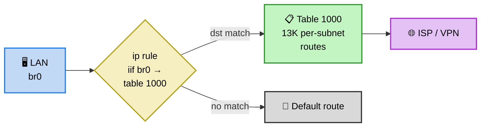
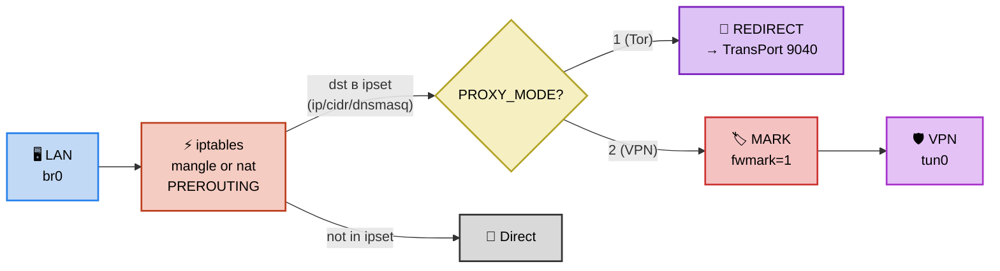

# Сравнение: geo-split vs ruantiblock

**Дата**: 2026-04-11  
**ruantiblock**: [gSpotx2f/ruantiblock](https://github.com/gSpotx2f/ruantiblock) (Entware-версия, **заброшена** — автор перешёл на [OpenWrt-версию](https://github.com/gSpotx2f/ruantiblock_openwrt))  
**geo-split**: v0.1.0 (local)

> ⚠️ **ruantiblock для Entware/Keenetic больше не обновляется.** README: «Ruantiblock для прошивки от Padavan больше не обновляется. Актуальная версия для OpenWrt находится [здесь](https://github.com/gSpotx2f/ruantiblock_openwrt)...»

---

## 1. Обзор проектов

| | **geo-split** | **ruantiblock** |
|---|---|---|
| **Назначение** | Селективная GEO-маршрутизация (страновые подсети) | Обход блокировок РКН (per-domain/per-IP из blacklist) |
| **Язык** | POSIX sh (~1200 строк) | sh (~1130) + Lua (~620) / Python (~560) / awk парсер |
| **Конфиг** | `config.sh` (shell vars) | `ruantiblock.conf` (shell vars) |
| **Платформа** | Keenetic + Entware | Keenetic/Padavan + Entware |
| **Статус** | Активен (v0.1.0) | **⛔ Заброшен** (OpenWrt-версия актуальна) |
| **Лицензия** | нет (private) | MIT |
| **Тесты** | shellcheck | нет |
| **opkg** | .ipk (ручная сборка) | нет (ручная установка) |

---

## 2. Архитектура маршрутизации

### Схема: geo-split (route-based)

### Схема: ruantiblock (fwmark / Tor redirect)

### Сравнение механизмов

| | **geo-split** | **ruantiblock** |
|---|---|---|
| **Routing метод** | `ip rule iif` + per-subnet routes | `iptables` MARK (VPN) или REDIRECT (Tor) |
| **fwmark** | ❌ Не используется | ✅ `VPN_PKTS_MARK=1` (VPN mode) |
| **iptables table** | Не используется | `mangle` (VPN) / `nat` (Tor) |
| **NDM совместимость** | ✅ Полная (skb->mark не затронут) | ❌ fwmark конфликт с per-device routing |
| **HW NAT** | ✅ Сохранён | ❌ Iptables отключает fastnat |
| **Tor support** | ❌ Нет | ✅ TransPort redirect |
| **Total proxy mode** | ❌ Нет | ✅ Весь трафик через proxy |

---

## 3. Data sources и парсинг

### Источники данных

| | **geo-split** | **ruantiblock** |
|---|---|---|
| **Тип данных** | Country-level GEO CIDR (ipdeny, RIPE) | Блэклисты РКН (antizapret, rublacklist, zapret-info) |
| **Формат** | Plain CIDR текст, RIPE JSON | CSV (с разными разделителями), JSON |
| **Записей** | ~13K CIDR подсетей | 30K-200K+ (IP + CIDR + FQDN) |
| **Модуль парсинга** | Pluggable loaders (sh + curl) | 3 модуля: Lua, Python, awk (sh) |
| **Пользовательские списки** | `domains.txt` + `@include` | `ruab_user_entries` (IP/CIDR/FQDN) |

### Парсеры ruantiblock — уникальная фича

ruantiblock имеет 3 взаимозаменяемых парсера блэклиста:
- **Lua** (`ruab_parser.lua`, ~620 строк) — рекомендуемый, быстрый
- **Python** (`ruab_parser.py`, ~560 строк) — альтернатива
- **sh/awk** (`ruab_parser.sh`, ~411 строк) — самый лёгкий, без зависимостей

Все три парсера обрабатывают CSV/JSON из антизапрет/рублэклист/zapret-info и производят:
- `ruantiblock.ip` — ipset restore формат (IP + CIDR → tmp sets)
- `ruantiblock.dnsmasq` — конфиг dnsmasq (`ipset=/domain/set-name` + `server=/domain/dns`)

**Оптимизации парсера**:
- Subdomain limit (`SD_LIMIT=16`) — если >16 субдоменов одного SLD → добавляется весь SLD
- IP aggregation (`IP_LIMIT`) — группировка IP в /24 при превышении лимита
- Фильтрация по шаблонам (`ENTRIES_FILTER`, `IP_FILTER`)
- IDN (punycode) для кириллических доменов
- Encoding conversion (CP1251 → UTF-8 для zapret-info)

geo-split не имеет аналогичной оптимизации — загружает plain CIDR as-is.

---

## 4. Domain routing

| | **geo-split** | **ruantiblock** |
|---|---|---|
| **Механизм** | `dig` → ipset + /32 routes (cron) | dnsmasq `ipset=` integration (real-time) |
| **Момент резолва** | Периодический (cron 15 мин) | При DNS-запросе клиента |
| **DNS override** | Нет (auto-detect SmartDNS) | `ALT_NSLOOKUP=1` + `ALT_DNS_ADDR` per-domain |
| **dnsmasq restart** | Не трогает dnsmasq | Принудительный restart при каждом обновлении |
| **ipset timeout** | Нет (постоянные записи) | `IPSET_DNSMASQ_TIMEOUT=3600` (TTL 1 час) |

ruantiblock генерирует dnsmasq конфиг с `server=` и `ipset=` директивами для каждого заблокированного домена. Это обеспечивает real-time domain routing, но **перезапускает dnsmasq** при каждом обновлении списков.

---

## 5. ipset архитектура

| | **geo-split** | **ruantiblock** |
|---|---|---|
| **Кол-во ipsets** | 1 (`geo-split`, hash:net) | 5-7 (ip, ip-tmp, cidr, cidr-tmp, dnsmasq, onion, total-proxy) |
| **Роль ipset** | Вспомогательная (routing через routes) | **Ядро маршрутизации** (iptables match) |
| **Atomic swap** | ✅ (tmp → main через `ipset swap`) | ✅ (tmp → main через `ipset swap`) |
| **maxelem** | По умолчанию (65536) | 1 000 000 |
| **Timeout** | Нет | 3600 сек для dnsmasq-set |
| **Тип** | `hash:net` только | `hash:ip` + `hash:net` (раздельно) |

ruantiblock разделяет IP и CIDR в отдельные ipsets (`hash:ip` vs `hash:net`), что эффективнее по памяти при большом количестве /32 адресов.

---

## 6. Интеграция с роутером

| | **geo-split** | **ruantiblock** |
|---|---|---|
| **NDM ifstatechanged** | ✅ Хук с failover-логикой | ❌ Нет NDM хуков |
| **NDM netfilter** | ❌ (route-based) | ❌ Нет |
| **Cron** | ✅ каждые 15 мин (через postinst) | ❌ Нет автоматического cron |
| **Init script** | S99geo-split (7 команд) | S40ruantiblock (5 команд) |
| **HTML status** | ❌ | ✅ HTML-страница в `/opt/share/www/custom/` |
| **Boot order** | S99 (последний) | S40 (ранний) |
| **dnsmasq restart cmd** | Не трогает | `/sbin/restart_dhcpd; /sbin/restart_dns` |
| **Interface failover** | ✅ Multi-iface download + NDM hook | ❌ Нет failover |

⚠️ ruantiblock **не имеет NDM хуков** — при падении VPN маршруты не пересоздаются автоматически. Нужен ручной restart или внешний watchdog.

---

## 7. Количественное сравнение

| Метрика | **geo-split** | **ruantiblock** |
|---------|:-:|:-:|
| Строк кода (prod) | ~1200 sh + ~106 lib | ~1130 sh + ~620 lua / ~560 py |
| Зависимости runtime | ip-full, ipset, curl, dig | ipset, iptables, wget, (lua/python) |
| Архитектур | any (POSIX sh) | any (POSIX sh + lua/python) |
| NDM hooks | 1 (ifstatechanged) | 0 |
| Cron | ✅ auto (postinst) | ❌ ручная настройка |
| opkg packaging | ✅ .ipk | ❌ ручная установка |
| Последнее обновление | 2026 (активен) | ~2022 (**заброшен**) |

---

## 8. Что есть в ruantiblock, чего нет в geo-split

| Фича | Актуальность для нас |
|-------|---------------------|
| **Tor support** (TransPort redirect) | 🔵 Другой use case |
| **3 модуля парсинга** (Lua/Python/awk) | 🟡 Концептуально интересно, но loaders покрывают |
| **РКН blacklist sources** (antizapret, rublacklist, zapret-info) | 🟢 Можно добавить как loader |
| **Subdomain aggregation** (SD_LIMIT) | 🟡 Полезно при больших domain list |
| **IP aggregation** (/24 compression) | 🟡 Полезно для оптимизации ipset |
| **Total proxy mode** | 🟢 Простая реализация |
| **HTML status page** | 🔵 Низкий приоритет |
| **IDN/punycode** поддержка | 🟡 Нужна для кириллических доменов |
| **Отдельные ipsets** (hash:ip + hash:net) | 🟡 Оптимизация памяти |
| **Entries filter** (exclude patterns) | 🟡 Полезно для исключений |

---

## 9. Что есть в geo-split, чего нет в ruantiblock

| Фича | |
|-------|--|
| **Route-based подход** (без fwmark) | Архитектурное преимущество |
| **NDM hooks** (interface up/down) | Надёжность при переключениях |
| **Auto-detect ISP interface** | Plug-and-play |
| **Multi-interface download failover** | Надёжность загрузки |
| **`ip-full -batch`** (13K routes за ~1s) | Производительность |
| **Cache age tracking** (smart refresh) | Экономия ресурсов |
| **Cron автоматическая настройка** (postinst) | Usability |
| **opkg packaging** (.ipk) | Установка/обновление |
| **DNS resolver auto-detect** | SmartDNS совместимость |
| **PID lock** (anti-parallel) | Robustness |
| **`@include`** в списках | Модульность |
| **Pluggable loaders** (расширяемые) | Модульность |
| **HW NAT сохранён** | Производительность |
| **Keenetic NDM совместимость** | Совместимость |

---

## 10. Ключевые выводы

### ruantiblock — исторический предшественник

ruantiblock был **первым популярным решением** для обхода блокировок на Keenetic/Padavan. Но:
- **⛔ Заброшен** для Entware (автор перешёл на OpenWrt)
- Нет NDM хуков → нет реакции на интерфейсные события
- Нет cron в пакете → нет автообновления
- fwmark конфликт с Keenetic NDM
- Padavan-специфичные команды (`/sbin/restart_dhcpd; /sbin/restart_dns`)

### Разные задачи

| | **geo-split** | **ruantiblock** |
|---|---|---|
| **Задача** | GEO routing (вся страна) | Антицензура (конкретные сайты) |
| **Целевой пользователь** | «RU-трафик через ISP, остальное через VPN» | «Заблокированные сайты через Tor/VPN» |
| **Данные** | Country CIDR (ipdeny) | РКН blacklists (antizapret/rublacklist) |
| **Масштаб** | ~13K CIDR | 30K-200K+ записей |

### Архитектурное превосходство geo-split

1. **Route-based** → совместим с Keenetic NDM, HW NAT сохранён
2. **NDM hooks** → автоматическая реакция на interface up/down
3. **Активная разработка** vs заброшенный проект
4. **opkg packaging** → чистая установка/удаление
5. **Cron автоматизация** → self-maintaining

### Что стоит позаимствовать

1. ✓ **РКН sources** как дополнительные loaders (antizapret CIDR)
2. ✓ **Subdomain aggregation** при масштабировании domain lists
3. ✓ **Entries filter** (exclude patterns для исключения доменов)
4. ? **Отдельные ipsets** (hash:ip для /32, hash:net для CIDR) — оптимизация памяти
