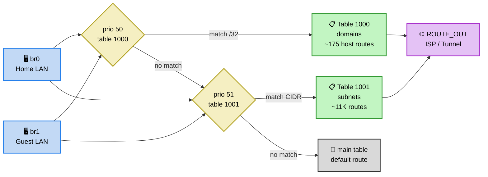

# Поддержка нескольких входных интерфейсов и нумерация таблиц

## Несколько входных интерфейсов

Параметр `ROUTE_IN` в [`defaults.conf`](../config/defaults.conf) задаёт **список LAN-интерфейсов через пробел**:

```sh
# Source LAN/tunnel interfaces for ip rule iif (space-separated)
# Each interface gets its own ip rule → custom route table
# Keenetic bridges: br0 = Home LAN, br1 = Guest network
ROUTE_IN="br0"
```

Пример с двумя интерфейсами: `ROUTE_IN="br0 br1"`.

---

## Нумерация таблиц: по типу данных, а не по интерфейсу

Таблицы нумеруются **по типу данных**:

| Table | Priority | Содержимое |
|-------|----------|------------|
| **1000** | 50 | Domains — /32 host routes (~175 записей) |
| **1001** | 51 | Subnets — GeoIP CIDR (~11K записей) |
| 1002+ | 52+ | (зарезервировано для будущих списков) |

Конфигурация:
```sh
DOMAIN_ROUTE_TABLE="1000"
DOMAIN_RULE_PRIORITY="50"
SUBNET_ROUTE_TABLE="1001"
SUBNET_RULE_PRIORITY="51"
```

---

## Механизм: один набор таблиц, много ip rules

Routing tables — **shared state**. Маршруты внутри таблиц 1000/1001 одинаковы для всех интерфейсов. Каждый входной интерфейс лишь получает свой набор `ip rule`, указывающий на те же самые общие таблицы.

Реализация в [`attach-rules.sh`](../scripts/attach-rules.sh):

```sh
for iface in $ROUTE_IN; do
    ip rule add iif "$iface" table "$DOMAIN_ROUTE_TABLE" priority "$DOMAIN_RULE_PRIORITY"
    ip rule add iif "$iface" table "$SUBNET_ROUTE_TABLE" priority "$SUBNET_RULE_PRIORITY"
done
```

[`detach-rules.sh`](../scripts/detach-rules.sh) аналогично удаляет правила для каждого интерфейса, а затем flush-ит обе таблицы однократно.

---

## Пример: `ROUTE_IN="br0 br1"`

Создаются следующие ip rules:

```
ip rule add iif br0 table 1000 priority 50   # br0 → domains
ip rule add iif br0 table 1001 priority 51   # br0 → subnets
ip rule add iif br1 table 1000 priority 50   # br1 → domains
ip rule add iif br1 table 1001 priority 51   # br1 → subnets
```

**Итого**: 2 таблицы (1000, 1001) × N интерфейсов ip rules. Таблицы не дублируются и не перенумеровываются — только rules множатся.

---

## Визуализация



Трафик, не попавший ни в один маршрут в таблицах 1000/1001, проходит дальше по main table (обычный default route).
