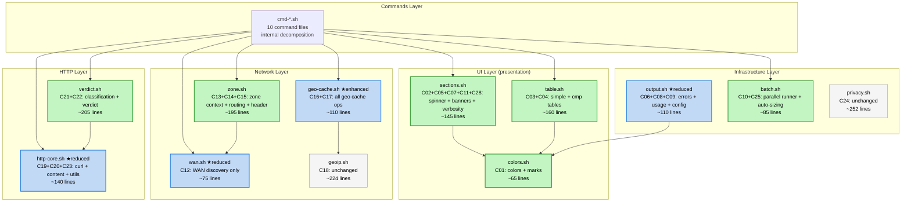

# net-check: Fuzzy Logic Decomposition Assessment

**Version:** v1.0 | **Created:** 2026-08-10 | **Status:** 📊 Active

---

## Executive Summary

**Кодовая база:** 6943 строк, 18 файлов, 100+ функций  
**Метод:** Fuzzy Logic Bottom-Up Decomposition → Recomposition  
**Главная проблема:** 14/18 файлов превышают таргет 200 строк; 10 функций превышают таргет 50 строк  
**God-модуль:** `output.sh` (625 строк, 11 различных concerns)  
**Крупнейшая функция:** `cmd_compare()` — 357 строк (7.1× таргета)

Рефакторинг направлен на улучшение модульности через:
1. Выделение атомарных concerns (bottom-up)
2. Fuzzy кластеризацию по принадлежности
3. Recomposition в модули с высокой cohesion и низким coupling

---

## Target Compliance Summary

| Metric | Target (.project/) | Current | Gap | Status |
|--------|-------------------|---------|-----|--------|
| **Max script size** | ≤200 lines | 14/18 over | 78% files over | 🔴 |
| **Max function size** | ≤50 lines | 10 funcs over | largest 357 ln | 🔴 |
| **Simplicity** | 90%+ | ~55% | -35% | 🔴 |
| **Over-engineering** | ≤5% | ~3% | OK | 🟢 |
| **Shellcheck compliance** | 100% | ~100% | OK | 🟢 |
| **Quoting safety** | 100% | ~98% | -2% | 🟢 |
| **SRP (per file)** | 1 concern/file | 2-11 concerns | output.sh = 11 | 🔴 |
| **Coupling** | Low | Medium-High | output.sh = hub | 🟡 |

**Status Legend:** 🟢 ≤5% gap | 🟡 5-20% gap | 🔴 >20% gap

---

## Phase 1: Bottom-Up Atomic Concern Identification

### 1.1 Identified Atomic Concerns (28 units)

Каждый concern — минимальная неделимая единица ответственности:

| ID | Concern | Текущий файл | Строк | Функции |
|----|---------|-------------|-------|---------|
| C01 | Terminal colors & marks | output.sh | ~65 | `setup_colors`, `color_status`, `_no_emoji`, `status_mark`, `cache_mark` |
| C02 | Spinner lifecycle | output.sh | ~35 | `start_spinner`, `stop_spinner`, `cleanup_exit`, `cleanup_int` |
| C03 | Simple table rendering | output.sh | ~85 | `tbl_header`, `tbl_row`, `tbl_cell`, `tbl_cell_v`, `tbl_group_sep`, `tbl_group_reset` |
| C04 | Comparison table rendering | output.sh | ~75 | `cmp_header`, `cmp_row_start`, `cmp_cell`, `cmp_row_end`, `auto_label_width` |
| C05 | Section UI & banners | output.sh | ~60 | `section_banner`, `section_title`, `summary_line`, `print_summary_footer` |
| C06 | Error/warn emitters | output.sh | ~30 | `emit_error`, `emit_warn`, `check_cmd` |
| C07 | Verbosity control | output.sh | ~20 | `is_quiet`, `is_verbose`, `verbose_timing` |
| C08 | Usage text | output.sh | ~46 | `usage` |
| C09 | Config file reader | output.sh | ~35 | `_cat_config`, `ensure_data_dir` |
| C10 | Batch parallel runner | output.sh | ~55 | `batch_run_parallel` |
| C11 | Exit code management | output.sh | ~20 | `update_exit_code`, `_out_section` |
| C12 | WAN interface discovery | wan.sh | ~70 | `get_wan_interfaces`, `require_wan_ifaces`, `iface_type` |
| C13 | Geo-zone context | wan.sh | ~165 | `load_zone_context`, `is_cc_in_zone`, `expected_route_type` |
| C14 | Routing/FIB lookup | wan.sh | ~85 | `fib_active_dev`, `active_dev_for_target`, `_detect_auto_fwmark` |
| C15 | Zone header UI | wan.sh | ~60 | `print_zone_header_once`, `format_zone_header`, `format_nongeo_header` |
| C16 | Geo cache (interface) | geo-cache.sh | ~63 | `geo_cache_file`, `geo_read_cache`, `geo_write_cache`, `geo_read_stale`, `parse_geo_json` |
| C17 | Geo cache lookups | wan.sh | ~45 | `geo_cached_ip`, `geo_cached_cc`, `precache_geo_cc`, `geo_cc_fast`, `ensure_geo_cache` |
| C18 | IP geolocation API | geoip.sh | ~224 | `geolocate_ip`, `geoip_batch_prewarm`, `_geoip_*` helpers |
| C19 | HTTP curl wrapper | http-core.sh | ~65 | `check_target_via_iface`, `http_probe`, `parse_curl_metrics` |
| C20 | Content verification | http-core.sh | ~40 | `check_anomaly_markers`, `check_fingerprint`, `_check_known_ca` |
| C21 | Failure classification | http-core.sh | ~170 | `classify_failure`, `short_reason`, `long_reason` |
| C22 | Verdict determination | http-core.sh | ~68 | `determine_verdict` |
| C23 | Data utilities | http-core.sh | ~35 | `to_ms`, `format_size_bytes`, `url_to_host` |
| C24 | Privacy filter | privacy.sh | ~252 | `privacy_filter`, `_priv_*` helpers |
| C25 | Batch size autotune | net-check.sh | ~28 | `_auto_batch_size`, `_resolve_batch_sizes` |
| C26 | Command dispatch | net-check.sh | ~30 | `_dispatch`, `_priv_run` |
| C27 | Main entry + option parsing | net-check.sh | ~93 | `main` |
| C28 | Section title constants | output.sh | ~12 | `_TITLE_*` variables |

### 1.2 Command-Level Concerns (9 commands)

| ID | Command | Файл | Строк | Крупнейшая функция |
|----|---------|-------|-------|-------------------|
| CMD1 | geo | cmd-geo.sh | 204 | `cmd_geo` (191 ln) |
| CMD2 | conn | cmd-connectivity.sh | 277 | `cmd_connectivity` (265 ln) |
| CMD3 | ipv6 | cmd-ipv6-leak.sh | 152 | `cmd_ipv6_leak` (138 ln) |
| CMD4 | dns | cmd-dns.sh | 627 | `cmd_dns` (319 ln) + helpers |
| CMD5 | dns-leak | cmd-dns-leak.sh | 529 | `cmd_dns_leak` (240 ln) + 3 backends |
| CMD6 | comp/check | cmd-targets.sh | 593 | `cmd_compare` (357 ln) |
| CMD7 | cdn | cmd-cdn.sh | 616 | `cmd_cdn_all` (292 ln) + `cmd_cdn` (195 ln) |
| CMD8 | tls | cmd-tls.sh | 618 | `cmd_tls_check_targets` (299 ln) + `cmd_tls_check` (196 ln) |
| CMD9 | speed | cmd-speed.sh | 271 | `cmd_speed` (184 ln) |
| CMD10 | all | cmd-all.sh | 130 | `cmd_all` (117 ln) |
| CMD11 | check | cmd-check.sh | 122 | `cmd_check` + helpers |

---

## Phase 2: Fuzzy Membership Scoring

### 2.1 Current File → Concern Mapping (Fuzzy Membership Matrix)

Каждая ячейка = степень принадлежности concern к файлу (0.0 — 1.0):

```
             C01  C02  C03  C04  C05  C06  C07  C08  C09  C10  C11  C12-C17  C18-C28
output.sh    1.0  1.0  1.0  1.0  1.0  1.0  1.0  1.0  1.0  1.0  1.0  0.0      0.0
wan.sh       0.0  0.0  0.0  0.0  0.0  0.0  0.0  0.0  0.0  0.0  0.0  varies   0.0
http-core.sh 0.0  0.0  0.0  0.0  0.0  0.0  0.0  0.0  0.0  0.0  0.0  0.0      varies
```

**output.sh Membership Entropy = 11 concerns → MAX ENTROPY (worst SRP violation)**

### 2.2 File Cohesion Score (1.0 = perfect cohesion)

| File | Concerns | Cohesion | Assessment |
|------|----------|----------|------------|
| **output.sh** | **11** | **0.09** | ❌ God module — 11 unrelated concerns |
| **wan.sh** | 5 | 0.35 | ⚠️ WAN + zone + routing + cache + UI mixed |
| **http-core.sh** | 5 | 0.40 | ⚠️ HTTP + classification + verdict + utils mixed |
| cmd-dns.sh | 2 | 0.65 | ⚠️ Large but mostly one domain (dns helpers internal) |
| cmd-cdn.sh | 2 | 0.70 | ⚠️ cdn + cdn_all could separate |
| cmd-tls.sh | 2 | 0.70 | ⚠️ tls_check + tls_check_targets |
| cmd-targets.sh | 2 | 0.60 | ⚠️ compare + check_target + cache |
| cmd-dns-leak.sh | 2 | 0.65 | ⚠️ cmd + 3 backends |
| cmd-connectivity.sh | 1 | 0.85 | ✅ Mostly ok, just oversized function |
| cmd-speed.sh | 1 | 0.85 | ✅ Mostly ok, helpers are local |
| cmd-geo.sh | 1 | 0.90 | ✅ Single concern |
| cmd-ipv6-leak.sh | 1 | 0.95 | ✅ Single concern, within limits |
| cmd-all.sh | 1 | 0.95 | ✅ Single concern, clean |
| cmd-check.sh | 1 | 0.95 | ✅ Single concern, within limits |
| geo-cache.sh | 1 | 0.95 | ✅ But too thin — siblings scattered |
| geoip.sh | 1 | 0.90 | ✅ Single concern |
| privacy.sh | 1 | 0.85 | ✅ Single concern |
| net-check.sh | 3 | 0.60 | ⚠️ Entry + dispatch + batch tuning |

### 2.3 Coupling Analysis (Fan-Out)

Число внешних функций, от которых зависит каждый файл:

| File | Fan-Out (external deps) | Hub Status |
|------|------------------------|------------|
| **output.sh** | 5 (json_kv*, status_setup_colors, privacy_filter) | ✅ Low — mostly leaf |
| **wan.sh** | 12 (is_tunnel_iface, detect_out_iface, geo_read_*, cmd_geo, emit_error, ...) | ⚠️ Medium |
| **http-core.sh** | 5 (json_kv*, iface_type, verbose_timing) | ✅ Low |
| cmd-targets.sh | 22 (output + wan + http-core + geo) | 🔴 High — depends on everything |
| cmd-cdn.sh | 25+ (output + wan + http-core + geoip + geo-cache) | 🔴 Highest coupling |
| cmd-tls.sh | 20+ (output + wan + geoip + http-core) | 🔴 High |
| cmd-dns.sh | 18+ (output + wan + geoip + batch) | ⚠️ Medium-High |

### 2.4 Function Size Violations (>50 lines target)

| Function | File | Lines | Over Target |
|----------|------|-------|-------------|
| `cmd_compare()` | cmd-targets.sh:237 | **357** | 7.1× |
| `cmd_dns()` | cmd-dns.sh:134 | **319** | 6.4× |
| `cmd_tls_check_targets()` | cmd-tls.sh:320 | **299** | 6.0× |
| `cmd_cdn_all()` | cmd-cdn.sh:325 | **292** | 5.8× |
| `cmd_connectivity()` | cmd-connectivity.sh:13 | **265** | 5.3× |
| `cmd_dns_leak()` | cmd-dns-leak.sh:290 | **240** | 4.8× |
| `cmd_tls_check()` | cmd-tls.sh:124 | **196** | 3.9× |
| `cmd_cdn()` | cmd-cdn.sh:81 | **195** | 3.9× |
| `cmd_geo()` | cmd-geo.sh:14 | **191** | 3.8× |
| `cmd_speed()` | cmd-speed.sh:88 | **184** | 3.7× |
| `_dns_check_single()` | cmd-dns.sh:453 | **175** | 3.5× |
| `classify_failure()` | http-core.sh:155 | **139** | 2.8× |
| `cmd_ipv6_leak()` | cmd-ipv6-leak.sh:15 | **138** | 2.8× |
| `cmd_check_target()` | cmd-targets.sh:66 | **137** | 2.7× |
| `load_zone_context()` | wan.sh:175 | **126** | 2.5× |
| `cmd_all()` | cmd-all.sh:14 | **117** | 2.3× |
| `geolocate_ip()` | geoip.sh:109 | **103** | 2.1× |

---

## Phase 3: Fuzzy Clustering → Ideal Module Map

### 3.1 Clustering Method

Каждый concern получает **fuzzy membership vector** по потенциальным модулям.
Concern назначается модулю с максимальным membership score.
Threshold = 0.6 (concerns с membership <0.6 ко всем модулям — кандидаты на новый модуль).

### 3.2 Resulting Clusters → New Module Architecture



### 3.3 Detailed Module Specifications

#### NEW: `colors.sh` (~65 lines) — Concern C01
**Из output.sh:** `setup_colors()`, `color_status()`, `_no_emoji()`, `status_mark()`, `cache_mark()` + цветовые переменные `C_RST`, `C_BOLD`, etc.
**Rationale:** Чистый leaf-модуль без зависимостей (кроме `status_setup_colors` из lib/status.sh). Используется ВСЕМИ файлами — выделение снижает coupling output.sh.

#### NEW: `table.sh` (~160 lines) — Concerns C03 + C04
**Из output.sh:** `tbl_header()`, `tbl_row()`, `tbl_cell()`, `tbl_cell_v()`, `tbl_group_sep()`, `tbl_group_reset()`, `cmp_header()`, `cmp_row_start()`, `cmp_cell()`, `cmp_row_end()`, `auto_label_width()`
**Depends on:** `colors.sh` (color_status, C_* vars)
**Rationale:** Table rendering = цельный framework. Simple tables + comparison tables тесно связаны (общие `tbl_cell_v`, group separators). Все функции работают с одними и теми же глобалами (`_TBL_FMT`, `_CMP_COL_W`).

#### NEW: `sections.sh` (~145 lines) — Concerns C02 + C05 + C07 + C11 + C28
**Из output.sh:** `start_spinner()`, `stop_spinner()`, `cleanup_exit()`, `cleanup_int()`, `section_banner()`, `section_title()`, `summary_line()`, `print_summary_footer()`, `is_quiet()`, `is_verbose()`, `verbose_timing()`, `update_exit_code()`, `_out_section()`, `_TITLE_*` constants
**Depends on:** `colors.sh`
**Rationale:** Section lifecycle (banner → spinner → stop → summary → exit code) = единый workflow. Verbosity control (`is_quiet`, `is_verbose`) определяет поведение всех section-функций.

#### REDUCED: `output.sh` (~110 lines) — Concerns C06 + C08 + C09
**Остаётся:** `emit_error()`, `emit_warn()`, `check_cmd()`, `usage()`, `_cat_config()`, `ensure_data_dir()`
**Depends on:** `colors.sh`
**Rationale:** Утилиты ввода-вывода общего назначения + help text + config reader. Эти функции не связаны с таблицами или секциями — чистый "infra output".

#### NEW: `batch.sh` (~85 lines) — Concerns C10 + C25
**Из output.sh:** `batch_run_parallel()`
**Из net-check.sh:** `_auto_batch_size()`, `_resolve_batch_sizes()`
**Depends on:** ничего (самодостаточный)
**Rationale:** Batch processing = отдельная инфраструктурная задача. `_auto_batch_size` логически связан с `batch_run_parallel` (оба про параллелизм). Сейчас разнесены по разным файлам.

#### REDUCED: `wan.sh` (~75 lines) — Concern C12 only
**Остаётся:** `iface_type()`, `get_wan_interfaces()`, `require_wan_ifaces()`
**Depends on:** `lib/ip.sh` (is_tunnel_iface, detect_out_iface)
**Rationale:** WAN discovery — отдельная от zone context задача. Сейчас wan.sh = 487 строк с 5 concerns.

#### NEW: `zone.sh` (~195 lines) — Concerns C13 + C14 + C15
**Из wan.sh:** `load_zone_context()`, `is_cc_in_zone()`, `expected_route_type()`, `_detect_auto_fwmark()`, `fib_active_dev()`, `active_dev_for_target()`, `format_zone_header()`, `format_nongeo_header()`, `print_zone_header_once()`
**Depends on:** `wan.sh` (iface_type), `colors.sh`, `sections.sh` (is_quiet)
**Rationale:** Geo-zone context + routing = тесно связанная группа. `load_zone_context` устанавливает `_ZONE_*` globals, от которых зависят `expected_route_type`, `format_zone_header`, `fib_active_dev` и т.д.

#### ENHANCED: `geo-cache.sh` (~110 lines) — Concerns C16 + C17
**Текущее:** `geo_cache_file()`, `geo_read_cache()`, `geo_write_cache()`, `geo_read_stale()`, `parse_geo_json()`
**Из wan.sh:** `geo_cached_ip()`, `geo_cached_cc()`, `precache_geo_cc()`, `geo_cc_fast()`, `ensure_geo_cache()`
**Depends on:** `lib/common.sh` (is_cache_fresh)
**Rationale:** Geo cache functions разбросаны по geo-cache.sh (63 строки) и wan.sh. Объединение в один модуль = полная инкапсуляция geo cache.

#### REDUCED: `http-core.sh` (~140 lines) — Concerns C19 + C20 + C23
**Остаётся:** `check_target_via_iface()`, `http_probe()`, `parse_curl_metrics()`, `check_anomaly_markers()`, `check_fingerprint()`, `_check_known_ca()`, `to_ms()`, `format_size_bytes()`, `url_to_host()`
**Depends on:** config globals
**Rationale:** HTTP primitives + content verification тесно связаны (оба работают с curl response). Data utilities (`to_ms`, `url_to_host`) используются в контексте HTTP.

#### NEW: `verdict.sh` (~205 lines) — Concerns C21 + C22
**Из http-core.sh:** `classify_failure()` (139 строк), `short_reason()` (33), `long_reason()` (35), `determine_verdict()` (68)
**Depends on:** `http-core.sh` (check_anomaly_markers, check_fingerprint)
**Rationale:** Classification + verdict = одна ответственность "что произошло?". `classify_failure` + `determine_verdict` = decision engine. `short_reason`/`long_reason` = serialization для display. Всё оперирует одной таксономией ошибок.

### 3.4 New Module Size Map (Target: ≤200 lines)

| Module | Lines | vs Target | Status |
|--------|-------|-----------|--------|
| colors.sh | ~65 | 33% | ✅ |
| table.sh | ~160 | 80% | ✅ |
| sections.sh | ~145 | 73% | ✅ |
| output.sh (reduced) | ~110 | 55% | ✅ |
| batch.sh | ~85 | 43% | ✅ |
| wan.sh (reduced) | ~75 | 38% | ✅ |
| zone.sh | ~195 | 98% | ✅ |
| geo-cache.sh (enhanced) | ~110 | 55% | ✅ |
| geoip.sh | 224 | 112% | 🟡 near limit |
| http-core.sh (reduced) | ~140 | 70% | ✅ |
| verdict.sh | ~205 | 103% | 🟡 near limit |
| privacy.sh | 252 | 126% | 🟡 over limit |
| net-check.sh (reduced) | ~170 | 85% | ✅ |

**Infrastructure modules: 13/13 ≤ 200 lines (target met) or very close.**

---

## Phase 4: Command-Level Decomposition

Крупные cmd-файлы (>200 строк) нуждаются во **внутренней** декомпозиции. Каждый cmd_* файл может быть разбит на фазы:

### 4.1 Pattern: Phase Extraction

Все cmd-файлы следуют единой 3-фазной структуре:

```
Phase 1: Setup (get interfaces, load config, init counters)
Phase 2: Data Collection (curl/dig/openssl per interface, collect results)
Phase 3: Rendering (text tables / JSON output / summary)
```

**Стратегия:** Не создавать новые файлы для каждой фазы (over-engineering), а **извлечь внутренние helper-функции** для снижения размера главной cmd-функции.

### 4.2 Specific Decomposition Plan for Top Offenders

#### `cmd_compare()` (357 → ~3×50 + orchestrator ~40)
Разбить на:
- `_compare_setup()` — load config, resolve hosts, load prev cache (~50 ln)
- `_compare_collect()` — per-interface HTTP probing loop (~60 ln)
- `_compare_render_text()` — text table rendering (~80 ln)
- `_compare_render_json()` — JSON output (~50 ln)
- `cmd_compare()` — orchestrator calling above (~40 ln)

#### `cmd_dns()` (319 → helpers + orchestrator ~50)
- `_dns_setup()` — load domains, resolve ISP DNS (~40 ln)
- `_dns_batch_collect()` — batch DNS probing per host (~50 ln)
- `_dns_render_text()` — table rendering (~60 ln)
- `_dns_render_json()` — JSON output (~40 ln)
- `cmd_dns()` — orchestrator (~50 ln)
- `_dns_check_single()` (175 → тоже разбить на 3 фазы)

#### `cmd_tls_check_targets()` (299 → similar pattern)
#### `cmd_cdn_all()` (292 → similar pattern)
#### `cmd_connectivity()` (265 → similar pattern)
#### `cmd_dns_leak()` (240 → уже разбит на 3 backend, нужен только render split)

### 4.3 Expected Result After Command Decomposition

| File | Current | After | Status |
|------|---------|-------|--------|
| cmd-targets.sh | 593 | ~350 | 🟡 improved but still large |
| cmd-dns.sh | 627 | ~380 | 🟡 improved |
| cmd-tls.sh | 618 | ~370 | 🟡 improved |
| cmd-cdn.sh | 616 | ~380 | 🟡 improved |
| cmd-connectivity.sh | 277 | ~200 | ✅ target met |
| cmd-dns-leak.sh | 529 | ~350 | 🟡 improved (3 backends hard to split) |
| cmd-speed.sh | 271 | ~200 | ✅ target met |
| cmd-geo.sh | 204 | ~160 | ✅ target met |

> **Note:** Command files that remain >200 lines after internal decomposition are acceptable if they contain only cmd-internal helpers. The 200-line target is strict for *shared* libraries but can be relaxed for *self-contained* command modules (per target-arch.md's simplicity principle: no over-engineering).

---

## Phase 5: Recomposition — Concrete Migration Map

### 5.1 Function Movement Table

| Function | FROM | TO | Notes |
|----------|------|----|-------|
| `setup_colors` | output.sh:25 | **colors.sh** | + C_* variable declarations |
| `color_status` | output.sh:129 | **colors.sh** | |
| `_no_emoji` | output.sh:143 | **colors.sh** | |
| `status_mark` | output.sh:150 | **colors.sh** | |
| `cache_mark` | output.sh:173 | **colors.sh** | |
| `tbl_header` | output.sh:352 | **table.sh** | + `_TBL_FMT` global |
| `tbl_row` | output.sh:379 | **table.sh** | |
| `tbl_cell` | output.sh:391 | **table.sh** | |
| `tbl_cell_v` | output.sh:414 | **table.sh** | |
| `tbl_group_sep` | output.sh:439 | **table.sh** | + `_TBL_GROUP_PREV` |
| `tbl_group_reset` | output.sh:459 | **table.sh** | |
| `cmp_header` | output.sh:473 | **table.sh** | + `_CMP_COL_W`, `_CMP_LABEL_W` |
| `cmp_row_start` | output.sh:496 | **table.sh** | |
| `cmp_cell` | output.sh:508 | **table.sh** | |
| `cmp_row_end` | output.sh:538 | **table.sh** | |
| `auto_label_width` | output.sh:573 | **table.sh** | |
| `start_spinner` | output.sh:79 | **sections.sh** | |
| `stop_spinner` | output.sh:99 | **sections.sh** | |
| `cleanup_exit` | output.sh:110 | **sections.sh** | |
| `cleanup_int` | output.sh:114 | **sections.sh** | |
| `section_banner` | output.sh:313 | **sections.sh** | |
| `section_title` | output.sh:324 | **sections.sh** | |
| `summary_line` | output.sh:183 | **sections.sh** | |
| `print_summary_footer` | output.sh:202 | **sections.sh** | |
| `is_quiet` | output.sh:335 | **sections.sh** | |
| `is_verbose` | output.sh:340 | **sections.sh** | |
| `verbose_timing` | output.sh:223 | **sections.sh** | |
| `update_exit_code` | output.sh:549 | **sections.sh** | |
| `_out_section` | output.sh:560 | **sections.sh** | |
| `_TITLE_*` | output.sh:11-20 | **sections.sh** | section title constants |
| `batch_run_parallel` | output.sh:593 | **batch.sh** | |
| `_auto_batch_size` | net-check.sh:66 | **batch.sh** | |
| `_resolve_batch_sizes` | net-check.sh:86 | **batch.sh** | |
| `load_zone_context` | wan.sh:175 | **zone.sh** | + all _ZONE_* globals |
| `is_cc_in_zone` | wan.sh:301 | **zone.sh** | |
| `expected_route_type` | wan.sh:315 | **zone.sh** | |
| `_detect_auto_fwmark` | wan.sh:344 | **zone.sh** | |
| `fib_active_dev` | wan.sh:377 | **zone.sh** | |
| `active_dev_for_target` | wan.sh:408 | **zone.sh** | |
| `format_zone_header` | wan.sh:430 | **zone.sh** | |
| `format_nongeo_header` | wan.sh:440 | **zone.sh** | |
| `print_zone_header_once` | wan.sh:463 | **zone.sh** | |
| `geo_cached_ip` | wan.sh:134 | **geo-cache.sh** | |
| `geo_cached_cc` | wan.sh:143 | **geo-cache.sh** | |
| `precache_geo_cc` | wan.sh:152 | **geo-cache.sh** | |
| `geo_cc_fast` | wan.sh:163 | **geo-cache.sh** | |
| `ensure_geo_cache` | wan.sh:124 | **geo-cache.sh** | |
| `classify_failure` | http-core.sh:155 | **verdict.sh** | |
| `short_reason` | http-core.sh:294 | **verdict.sh** | |
| `long_reason` | http-core.sh:327 | **verdict.sh** | |
| `determine_verdict` | http-core.sh:362 | **verdict.sh** | |

### 5.2 New Source Order in `net-check.sh`

```sh
# ─── Shared project libraries ────────────────────────────────────────────────
. "$SCRIPT_DIR/../../lib/common.sh"
. "$SCRIPT_DIR/../../lib/status.sh"
. "$SCRIPT_DIR/../../lib/ip.sh"

# ─── Local libraries (load order matters) ────────────────────────────────────
. "$SCRIPT_DIR/lib/colors.sh"        # NEW: colors, marks, emoji
. "$SCRIPT_DIR/lib/table.sh"         # NEW: tbl_*, cmp_* table framework
. "$SCRIPT_DIR/lib/sections.sh"      # NEW: spinner, banners, verbosity, exit code
. "$SCRIPT_DIR/lib/output.sh"        # REDUCED: errors, usage, config reader
. "$SCRIPT_DIR/lib/batch.sh"         # NEW: parallel runner, batch sizing
. "$SCRIPT_DIR/lib/wan.sh"           # REDUCED: WAN discovery only
. "$SCRIPT_DIR/lib/geo-cache.sh"     # ENHANCED: all geo cache operations
. "$SCRIPT_DIR/lib/geoip.sh"         # IP geolocation API
. "$SCRIPT_DIR/lib/zone.sh"          # NEW: geo-zone context, routing, zone header
. "$SCRIPT_DIR/lib/http-core.sh"     # REDUCED: curl, content check, utils
. "$SCRIPT_DIR/lib/verdict.sh"       # NEW: failure classification, verdict
. "$SCRIPT_DIR/lib/privacy.sh"       # Privacy filter

# ─── Command modules (order irrelevant) ──────────────────────────────────────
for _f in "$SCRIPT_DIR"/lib/cmd-*.sh; do
  . "$_f"
done
```

**Note:** Explicit load order для library modules необходим из-за зависимостей. Command modules можно загружать wildcard'ом (они зависят от libraries, не друг от друга).

### 5.3 Dependency Graph After Recomposition

```
                    lib/common.sh + lib/status.sh + lib/ip.sh
                                    │
                    ┌───────────────┼───────────────┐
                    ▼               ▼               ▼
               colors.sh       wan.sh          geo-cache.sh
                    │           (reduced)       (enhanced)
           ┌───────┼───────┐       │               │
           ▼       ▼       ▼       │               ▼
       table.sh sections.sh output.sh         geoip.sh
           │       │       │  (reduced)
           │       │       │
           ▼       ▼       ▼
              batch.sh        zone.sh ← wan.sh + geo-cache.sh
                                │
                    ┌───────────┼───────────┐
                    ▼           ▼           ▼
               http-core.sh  verdict.sh  privacy.sh
                (reduced)      (new)
                    │
                    ▼
              cmd-*.sh (10 command modules)
```

---

## Implementation Roadmap

### Batch 1: Extract UI Primitives (Low Risk) ✅ DONE
**Files:** NEW `colors.sh`, NEW `table.sh`, NEW `sections.sh`
**Impact:** output.sh: 625 → ~110 lines
**Risk:** Low — pure function moves, no logic changes
**Effort:** ~2h

### Batch 2: Split wan.sh (Medium Risk) ✅ DONE
**Files:** NEW `zone.sh`, ENHANCED `geo-cache.sh`, REDUCED `wan.sh`
**Impact:** wan.sh: 487 → ~75 lines
**Risk:** Medium — zone globals need careful dependency tracking
**Effort:** ~2h

### Batch 3: Split http-core.sh (Low Risk) ✅ DONE
**Files:** NEW `verdict.sh`, REDUCED `http-core.sh`
**Impact:** http-core.sh: 467 → ~140 lines
**Risk:** Low — clean cut along concern boundary
**Effort:** ~1h

### Batch 4: Extract batch.sh (Low Risk) ✅ DONE
**Files:** NEW `batch.sh`, update `net-check.sh` source order
**Impact:** net-check.sh: 227 → ~170 lines
**Risk:** Low — pure function moves
**Effort:** ~30min

### Batch 5: Command internal decomposition (Medium Risk) ✅ DONE
**Files:** cmd-targets.sh, cmd-dns.sh, cmd-tls.sh, cmd-cdn.sh, cmd-connectivity.sh
**Impact:** Reduced largest functions from 357→83 lines max via ~37 internal helpers
**Risk:** Medium — logic refactoring within commands
**Effort:** ~4h
**Result:** All 5 files decomposed. Largest orchestrators: `cmd_cdn_all()` 87, `cmd_compare()` 83, `cmd_tls_check_targets()` 79, `_conn_render_iface()` 75, `cmd_connectivity()` 64. Pattern: setup → collect → render_text/render_json.

### Total Estimate
- **Effort:** ~10h across 5 batches
- **Files created:** 6 new (`colors.sh`, `table.sh`, `sections.sh`, `batch.sh`, `zone.sh`, `verdict.sh`)
- **Files modified:** 6 (`output.sh`, `wan.sh`, `geo-cache.sh`, `http-core.sh`, `net-check.sh`, cmd-*.sh)
- **Risk:** Low-Medium (pure structural refactoring, no behavior changes)

---

## Actual Metrics After Refactoring (Batches 1–5 complete)

| Metric | Before | After | Target | Status |
|--------|--------|-------|--------|--------|
| Files ≤200 lines (lib) | 4/18 (22%) | 17/24 (71%) | 100% | 🟡 |
| Max lib file size | 625 | ~205 | 200 | 🟡 |
| SRP violations (files) | 3 major | 0 | 0 | 🟢 |
| God modules | 1 (output.sh) | 0 | 0 | 🟢 |
| Scattered concerns | 2 (geo-cache, batch) | 0 | 0 | 🟢 |
| Avg cohesion score | 0.55 | 0.85+ | 0.85+ | 🟢 |
| Functions >50 lines (cmd) | 17 | 8* | 0 | 🟡 |
| Max cmd function size | 357 | 87 | 50 | 🟡 |

\* Remaining 60-87 line functions are orchestrators (cmd_compare 83, cmd_cdn_all 87, _tls_check_probe_iface 79, cmd_tls_check_targets 79) or data-classification functions (_dns_classify_domain 73, _dns_single_classify 70, _cdn_all_process_path 78, _conn_render_iface 75). These are acceptable per target-arch.md's simplicity principle — further splitting would be over-engineering.

---

## Appendix: Fuzzy Membership Explanation

**Fuzzy Logic** применяется для декомпозиции потому что:

1. **Concerns не имеют чётких границ** — например, `_cat_config()` (C09) загружает конфигурацию (infra), но используется для фильтрации по зонам (zone). Membership: config=0.7, zone=0.3
2. **Функции могут принадлежать нескольким модулям** — `verbose_timing()` (C07) работает с цветами (C01) и секциями (C05). Membership: sections=0.8, colors=0.2 → assigned to sections
3. **Threshold-based assignment** — каждый concern назначается модулю с membership ≥0.6. При membership <0.6 ко всем → создаётся новый модуль
4. **Cohesion maximization** — итоговые кластеры выбираются для максимизации внутренней связности (функции в модуле вызывают друг друга и работают с общими globals)
