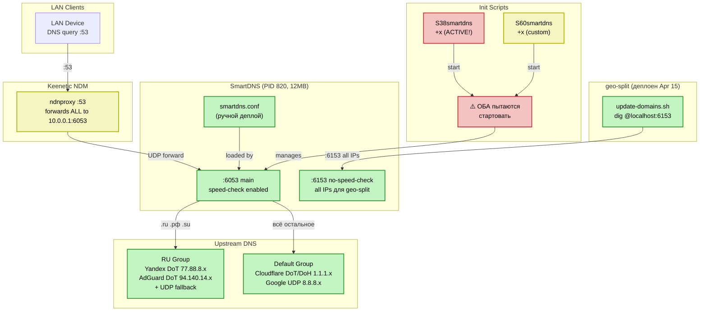

# smartdns-conf-ru-split — Assessment текущего состояния

**Version:** v1.1  
**Created:** 2026-04-16  
**Status:** ✅ Final  
**Scope:** Полный анализ подпроекта smartdns-conf-ru-split — скрипты, конфигурация, архитектура, gap analysis  
**Источники:** Репозиторий + live-данные с роутера router-1 (ssh, 2026-04-16)

---

## 1. Executive Summary

Подпроект `smartdns-conf-ru-split` находится в **рабочем, но разрозненном** состоянии. SmartDNS работает на роутере router-1 (PID 820, 12MB RSS, v46.1-1), обрабатывает DNS на портах 6053/6153, но **конфигурация на роутере управляется вручную** — проект как единица никогда не деплоился (`/opt/keenetic-entware-extras/smartdns-conf-ru-split/` отсутствует на роутере).

### Ключевые находки с роутера

| Факт | Значение | Влияние |
|------|----------|---------|
| SmartDNS работает | PID 820, порты 6053+6153 | ✅ Функционирует |
| Версия SmartDNS | 46.1-1 (opkg) | ✅ Актуальна |
| RAM (RSS) | 12 MB | ✅ Умеренно |
| **S38smartdns всё ещё +x** | `-rwxr-xr-x` (не отключён!) | 🔴 Конфликт: оба init пытаются стартовать |
| **Лог: "Server is already running"** | 6 записей подряд | 🔴 Подтверждает конфликт S38/S60 |
| ndnproxy → SmartDNS | `dns_server = 10.0.0.1:6053 .` | ✅ Все DNS через SmartDNS |
| Нет DNAT redirect | iptables PREROUTING — только NDM chains | ⚠️ DNS идёт через ndnproxy |
| **Проект не деплоен** | `/opt/keenetic-entware-extras/smartdns-conf-ru-split/` — **NOT FOUND** | 🔴 Конфиг/init управляются вручную |
| `/opt/etc/unblock/` удалён | Чисто — legacy убран | ✅ |
| geo-split деплоен | Скрипты от 15 апреля | ✅ |
| Конфиг — гибрид | Комментарии "geo-bypass" (не "geo-split"), но функции как в репо | ⚠️ Ручная правка |

### Общая оценка

- **Код в репозитории: ~92%** качества (shellcheck clean, POSIX sh, структура ОК)
- **Архитектура: ~55%** (нет packaging, rootfs, status.sh, DNAT)
- **Deployment maturity: ~30%** — проект существует только в репо, на роутер деплоится ad-hoc
- **Расхождение repo ↔ роутер: Существенное** — три разных версии конфига (backup, repo, live)

---

## 2. Инвентаризация: три среза реальности

### 2.1 Файлы и состояние

| Компонент | Репозиторий | Роутер (live) | Бэкап (2026-04-07) | Расхождение |
|-----------|------------|---------------|---------------------|-------------|
| `smartdns.conf` | v3: header с документацией, "geo-split" | v2: "geo-bypass", bind :6153, max-reply-ip-num | v1: нет bind :6153, нет max-reply-ip-num | 🔴 Три разных версии |
| `S60smartdns` | Внутри heredoc install.sh (v2: `|| true`, кавычки) | v1: `kill $PID` без кавычек | v1: идентичен live | ⚠️ Repo ahead |
| `S38smartdns` | install.sh делает `chmod -x` | **Всё ещё +x** (`-rwxr-xr-x`) | `-rwxr-xr-x` | 🔴 Не отключён! |
| Project dir | `smartdns-conf-ru-split/` полный | **НЕ СУЩЕСТВУЕТ** | — | 🔴 Не деплоен |
| `/opt/etc/unblock/` | — | **Удалён** (чисто) | Существовал | ✅ Убран |

### 2.2 Конфиг: подробный diff (repo vs live)

Конфиг на роутере — **промежуточная ручная версия**. Функционально близок к репо, но с другими комментариями:

| Аспект | Репозиторий | Роутер (live) |
|--------|------------|---------------|
| Header | "DNS-сервер с разделением по группам" + URLs | "optimized for MT7621/weak CPU" |
| Комментарий bind :6153 | "geo-split:" | "geo-bypass:" |
| Комментарий max-reply-ip-num | "Needed for geo-split:" | "Needed for geo-bypass:" |
| bind :6053 | ✅ | ✅ |
| bind :6153 -no-speed-check | ✅ | ✅ |
| max-reply-ip-num 16 | ✅ | ✅ |
| Upstream серверы | Идентичны | Идентичны |
| nameserver rules | Идентичны | Идентичны |
| Logging | Идентично | Идентично |

**Вывод:** Функционально конфиги **эквивалентны**. Расхождения только в комментариях (переименование geo-bypass → geo-split).

### 2.3 Обнаруженные проблемы на роутере

#### 🔴 CRITICAL: Конфликт init-скриптов S38 + S60

```
# S38smartdns — ВСЁ ЕЩЁ ИСПОЛНЯЕМЫЙ:
-rwxr-xr-x  root root  194  Mar 16 12:22  /opt/etc/init.d/S38smartdns

# S60smartdns — тоже исполняемый:
-rwxr-xr-x  root root  1970 Feb  2 15:19 /opt/etc/init.d/S60smartdns
```

При загрузке Entware запускает оба: S38 стартует SmartDNS первым (через rc.func), затем S60 пытается стартовать повторно. Подтверждается логом:

```
Server is already running, pid is 818
Server is already running, pid is 819
Server is already running, pid is 816
...
```

**Причина:** install.sh делает `chmod -x S38smartdns`, но **установка SmartDNS через opkg (`opkg install smartdns` или `opkg upgrade`) восстанавливает S38 с +x**. Март 2026 — вероятно, обновление opkg вернуло S38.

**Влияние:** Функционально не ломает (SmartDNS видит "already running" и не падает), но:
- Засоряет логи ошибками
- При `stop` через S60, S38 не знает об остановке (и наоборот)
- Неопределённое поведение при `restart` — кто главный?

#### ⚠️ ndnproxy как промежуточный DNS

```
# /tmp/ndnproxymain.conf:
dns_server = 10.0.0.1:6053 .
```

ndnproxy перенаправляет **все** DNS запросы на SmartDNS. Это значит:
- LAN Client → :53 (ndnproxy) → :6053 (SmartDNS) → upstream
- Добавляет один хоп, но ndnproxy делает это в userspace → latency ~несколько мс
- **Без DNAT**: ndnproxy добирает 2-4с latency (из TODO.md) — **но это уже было исправлено удалением DoT/DoH из Keenetic** (dns-config.txt бэкап от 10 апреля)

**Текущий DNS path:**
```
LAN Client → :53 (ndnproxy, plain UDP forward) → :6053 (SmartDNS) → upstream DoT/DoH
```

**Это работает нормально** после удаления Keenetic DoT/DoH. DNAT redirect остаётся оптимизацией, но не критичен.

---

## 3. Качество кода — Target Compliance

### 3.1 Shell-скрипты

| Метрика | Target (.project/) | Текущее | Gap | Статус |
|---------|-------------------|---------|-----|--------|
| Shellcheck compliance | 100% | 100% (install.sh, uninstall.sh) | 0% | 🟢 |
| Shebang | `#!/opt/bin/sh` | ✅ | 0% | 🟢 |
| `set -eu` | Обязательно | ✅ Оба скрипта | 0% | 🟢 |
| Кавычки переменных | 100% | 100% | 0% | 🟢 |
| Размер скрипта (max 200) | ≤200 строк | 174 / 92 ✅ | 0% | 🟢 |
| Размер функций (max 50) | ≤50 строк | max ~30 ✅ | 0% | 🟢 |
| Header comment | Обязательно | ✅ | 0% | 🟢 |
| Logging (logger -t) | Обязательно | ✅ log() + log_error() | 0% | 🟢 |
| Именование файлов | kebab-case.sh | ✅ | 0% | 🟢 |
| lib/common.sh + lib/status.sh | Используется | ✅ Подключено | 0% | 🟢 |
| BusyBox совместимость | 100% | ✅ Нет bashisms | 0% | 🟢 |
| Trap cleanup | Рекомендовано | ❌ Нет в install.sh | ~10% | 🟡 |
| Простота | 90%+ | 90%+ | 0% | 🟢 |
| Over-engineering | ≤5% | ~0% | 0% | 🟢 |

**Code Quality Score: ~92%**

### 3.2 Архитектура

| Метрика | Target (.project/) | Текущее | Gap | Статус |
|---------|-------------------|---------|-----|--------|
| Структура подпроекта | scripts/, config/, .project/, README | ✅ | 0% | 🟢 |
| **Packaging (.ipk)** | packaging/\<pkg\>/ | ❌ Отсутствует | 100% | 🔴 |
| **rootfs/ layout** | rootfs/opt/etc/init.d/ | ❌ Init в heredoc | 100% | 🔴 |
| **Deployment** | Деплоится как пакет | ❌ Ad-hoc ручной | 100% | 🔴 |
| Конфигурация external | config/, не hardcoded | ✅ | 0% | 🟢 |
| Init pattern | S##name | ✅ S60smartdns | 0% | 🟢 |
| PID files | /opt/var/run/ | ✅ | 0% | 🟢 |
| **Диагностика (status.sh)** | По аналогии с geo-split | ❌ Нет | 100% | 🔴 |

**Architecture Score: ~55%**

### 3.3 Конфигурация SmartDNS

| Аспект | Текущее | Оценка |
|--------|---------|--------|
| DNS группы (ru/default) | ✅ Правильное разделение | 🟢 |
| RU upstreams (Yandex+AdGuard DoT) | ✅ Правильные, резервирование | 🟢 |
| INT upstreams (Cloudflare DoT/DoH + Google UDP) | ✅ Правильные | 🟢 |
| Кэш (20000, serve-expired) | ✅ Достаточно для домашней сети | 🟢 |
| bind :6053 + :6153 | ✅ Основной + geo-split | 🟢 |
| max-reply-ip-num 16 | ✅ Для geo-split | 🟢 |
| force-AAAA-SOA yes | ✅ Оправдано без IPv6 | 🟢 |
| **`-k` на всех TLS** | ⚠️ Skip TLS verify | 🟡 |
| **Нет speed-check-mode** | ⚠️ Нет оптимизации выбора IP | 🟡 |
| **Нет ротации логов** | ⚠️ log-size/log-num отсутствуют | 🟡 |
| **Избыточные nameserver** | gov.ru и т.д. покрыты /.ru/ru | 🟢 Low |
| **serve-expired-prefetch-time 86400** | Завышено (лучше 21600) | 🟢 Low |

**Config Quality Score: ~80%**

---

## 4. Детальный анализ компонентов

### 4.1 `scripts/install.sh` (174 строки)

**Оценка: ✅ Хорошо (85%), но с архитектурным недостатком**

**Сильные стороны:**
- Shellcheck 100% clean, POSIX sh, `set -eu`
- Логичная пошаговая структура: opkg → backup → deploy → disable S38 → create S60 → start
- Root-check, config existence check
- Собственные log()/log_error() (не зависит от lib/common.sh)

**Проблемы:**

| # | Проблема | Сер. | Строка | Описание |
|---|---------|------|--------|----------|
| I1 | **Init в heredoc** | 🔴 | [`:79-164`](../scripts/install.sh:79) | S60 генерируется heredoc. Невозможно тестировать, упаковать, редактировать отдельно |
| I2 | **`chmod -x` не выживает opkg upgrade** | 🔴 | [`:72-75`](../scripts/install.sh:72) | opkg при обновлении smartdns восстанавливает S38 +x. На роутере: оба init +x |
| I3 | Нет trap cleanup | 🟡 | — | Если упадёт на середине → неконсистентное состояние |
| I4 | `opkg update` без проверки | 🟢 | [`:48`](../scripts/install.sh:48) | Может failed без интернета |

### 4.2 `scripts/uninstall.sh` (92 строки)

**Оценка: ✅ Хорошо (90%)**

Подтверждение от пользователя, корректная остановка, восстановление бэкапа. Единственный пробел — не знает о будущем dns-redirect.sh / S39.

### 4.3 S60smartdns (init-скрипт, встроен в heredoc)

**Оценка: ⚠️ Удовлетворительно (75%)**

| # | Проблема | Сер. | Описание |
|---|---------|------|----------|
| S1 | **Встроен в heredoc** | 🔴 | Нельзя тестировать/упаковать отдельно |
| S2 | **Нет `set -eu`** | 🟡 | Init работает без safety guards |
| S3 | Нет `status` action | 🟡 | case не обрабатывает status |
| S4 | На роутере — старая версия | 🟡 | `kill $PID` без кавычек (SC2086) |

### 4.4 `config/smartdns.conf` (111 строк)

**Оценка: ✅ Хорошо (80%)**

Функционально правильный конфиг. Области для улучшения:
- `-k` флаг → проверить работу без skip TLS verify
- Нет `speed-check-mode` → добавить `ping,tcp:80,tcp:443`
- Нет ротации логов → `log-size 128K`, `log-num 2`
- Избыточные явные nameserver rules (уже покрыты `/.ru/ru`)
- Нет `domain-set` для масштабируемого списка доменов

---

## 5. Архитектура текущего решения (на основе live-данных)



### DNS Path (текущий, рабочий)

```
LAN Client → :53 (ndnproxy) → :6053 (SmartDNS) → upstream DoT/DoH
```

ndnproxy форсированно перенаправляет все DNS на SmartDNS (`dns_server = 10.0.0.1:6053 .`).  
DoT/DoH из Keenetic были удалены 2026-04-10, поэтому ndnproxy работает как plain UDP forwarder.  
Latency приемлема (мс), но DNAT убирает лишний хоп.

---

## 6. Gap Analysis: Текущее vs Целевое

### 6.1 Функциональные пробелы

| # | Пробел | Текущее | Целевое | Gap | Приоритет |
|---|--------|---------|---------|-----|-----------|
| G1 | **S38/S60 конфликт** | Оба +x, лог "already running" | S38 отключён надёжно (переименование или prerm hook) | 100% | 🔴 Critical |
| G2 | **Проект не деплоен** | `/opt/.../smartdns-conf-ru-split/` не существует | Полный деплой как пакет | 100% | 🔴 Critical |
| G3 | **.ipk пакетирование** | Нет `packaging/smartdns-conf-ru-split/` | control, conffiles, postinst, prerm, postrm | 100% | 🔴 Critical |
| G4 | **rootfs/ layout** | Init в heredoc | `rootfs/opt/etc/init.d/S60smartdns` отдельный файл | 100% | 🔴 Critical |
| G5 | **Диагностика** | Нет | `scripts/status.sh` (процесс, порты, DNS тест, cache) | 100% | 🟡 High |
| G6 | DNS DNAT redirect | Нет (ndnproxy форвардит) | iptables DNAT для bypassing ndnproxy | 100% | 🟡 Medium* |
| G7 | Конфиг drift | "geo-bypass" vs "geo-split" | Единый source of truth из репо | 50% | 🟡 Medium |
| G8 | speed-check-mode | Нет | `speed-check-mode ping,tcp:80,tcp:443` | 100% | 🟢 Normal |
| G9 | Ротация логов | Нет | `log-size 128K`, `log-num 2` | 100% | 🟢 Normal |
| G10 | domain-set | Нет | Внешний файл `ru-domains.txt` | 100% | 🟢 Normal |
| G11 | ipset интеграция | Нет | SmartDNS `ipset` directive | 100% | 🟢 Normal |

*\*G6 понижен с Critical до Medium: после удаления Keenetic DoT/DoH, ndnproxy работает как plain UDP forwarder с минимальной latency. DNAT — оптимизация, не критический фикс.*

### 6.2 Сравнение с geo-split (эталон зрелости)

| Аспект | geo-split | smartdns-conf-ru-split | Gap |
|--------|-----------|-------------|-----|
| `packaging/<pkg>/` | ✅ control, conffiles, postinst, prerm, postrm | ❌ | 🔴 |
| `rootfs/` | ✅ S99geo-split | ❌ | 🔴 |
| Deployed on router | ✅ `/opt/.../geo-split/` | ❌ | 🔴 |
| `scripts/status.sh` | ✅ 7380 строк | ❌ | 🟡 |
| NDM hooks | ✅ ifstatechanged.d | ❌ | 🟡 |
| `.project/` | ✅ | ✅ | 🟢 |
| `config/` | ✅ config.conf | ✅ smartdns.conf | 🟢 |
| `docs/` | ✅ Подробные | ❌ | 🟡 |
| README.md | ✅ | ✅ | 🟢 |

---

## 7. Технический долг

### 🔴 Critical

| # | Проблема | Влияние | Effort | Описание |
|---|---------|---------|--------|----------|
| TD1 | **S38/S60 конфликт на роутере** | Оба init +x, дублирование start | 1ч | S38 восстанавливается при opkg upgrade. Решение: prerm hook в packaging или rename S38→S38smartdns.disabled |
| TD2 | **Init в heredoc install.sh** | Невозможно упаковать/тестировать S60 отдельно | 1ч | Вынести в `rootfs/opt/etc/init.d/S60smartdns` |
| TD3 | **Нет packaging/smartdns-conf-ru-split/** | Невозможно собрать .ipk | 2ч | Создать control, conffiles, postinst, prerm, postrm |
| TD4 | **Проект не деплоен** | Конфиг на роутере дрейфует (ручное управление) | 0.5ч | Деплой через .ipk или scp -R |

### 🟡 High

| # | Проблема | Влияние | Effort |
|---|---------|---------|--------|
| TD5 | Нет status.sh | Невозможно быстро диагностировать | 1.5ч |
| TD6 | `-k` на всех TLS | TLS verify отключён → потенциальный MITM | 0.5ч |
| TD7 | Конфиг drift (geo-bypass vs geo-split) | Рассинхронизация repo ↔ router | 0.1ч |

### 🟢 Normal

| # | Проблема | Влияние | Effort |
|---|---------|---------|--------|
| TD8 | Нет trap cleanup в install.sh | Неконсистентное состояние при ошибке | 0.3ч |
| TD9 | Избыточные nameserver rules | Мусор (уже покрыты /.ru/ru) | 0.1ч |
| TD10 | Нет speed-check-mode | DNS не оптимизирует fastest IP | 0.1ч |
| TD11 | Нет ротации логов | Лог может расти бесконечно | 0.1ч |
| TD12 | serve-expired-prefetch-time 86400 | Завышено, лучше 21600 | 0.1ч |
| TD13 | bind 0.0.0.0 | Доступен извне если firewall пропускает | 0.1ч |

**Estimated effort: ~7.5 часов**

---

## 8. Безопасность

| # | Аспект | Оценка | Деталь |
|---|--------|--------|--------|
| 1 | **TLS verification** | ⚠️ | Все upstream серверы с `-k` (skip verify). Нужно проверить без `-k` |
| 2 | Root-check в скриптах | ✅ | `id -u` проверяется |
| 3 | **bind 0.0.0.0** | ⚠️ | SmartDNS слушает на всех интерфейсах для 6053/6153. Если NAT/firewall пропускает — доступен из WAN |
| 4 | DNS leaks | ✅ | ndnproxy форсирует все DNS через SmartDNS. DoT/DoH из Keenetic удалены |
| 5 | opkg conffiles | ✅ | `smartdns.conf` зарегистрирован как conffile в opkg (SHA hash хранится) |

---

## 9. Рекомендации

### Немедленные действия (блокеры для .ipk)

1. **Вынести S60smartdns** из heredoc в `rootfs/opt/etc/init.d/S60smartdns`
2. **Создать `packaging/smartdns-conf-ru-split/`** с prerm-хуком который `chmod -x S38smartdns` (или rename)
3. **Решить конфликт S38/S60** — в postinst/prerm надёжно отключать S38 (rename → `.disabled`, не chmod)
4. **Синхронизировать конфиг** — деплой актуальной версии из репо на роутер

### Важные улучшения

5. Создать `scripts/status.sh` (процесс, порты, DNS тест, init состояние)
6. Убрать `-k` где возможно (проверить TLS)
7. Добавить `log-size`/`log-num` для ротации логов

### Оптимизация конфигурации (Phase 3)

8. `speed-check-mode ping,tcp:80,tcp:443`
9. Убрать избыточные nameserver rules
10. Рассмотреть `domain-set` для расширяемости
11. bind `127.0.0.1` вместо `0.0.0.0`
12. DNS DNAT redirect (оптимизация, не блокер)

---

## Appendix A: Методология

### Источники данных
- **Репозиторий**: 7 файлов smartdns-conf-ru-split/ + 3 файла .project/
- **Live-данные с роутера** (SSH, 2026-04-16): ps, netstat, cat configs, iptables, opkg info, dig tests, /tmp/ndnproxymain.conf, ls -la init scripts, /proc/PID/status
- **Бэкап 2026-04-07**: 7 файлов (smartdns.conf, init scripts, unblock/)
- **Бэкап 2026-04-10**: dns-config.txt (Keenetic DNS settings)
- **Архив**: docs/archive/smartdns-update-plan.md

### Инструменты
- `shellcheck -x -s sh` — статический анализ
- `diff` — сравнение трёх версий (repo / backup / live)
- SSH remote commands — актуальное состояние роутера
- `dig` — DNS-тесты через SmartDNS

### Ключевой инсайт
Бэкап от 7 апреля **уже устарел** к моменту анализа. Конфиг на роутере был обновлён вручную (добавлены bind :6153, max-reply-ip-num 16), но с другими комментариями ("geo-bypass"). Этот дрифт подтверждает необходимость автоматизированного деплоя через .ipk.
