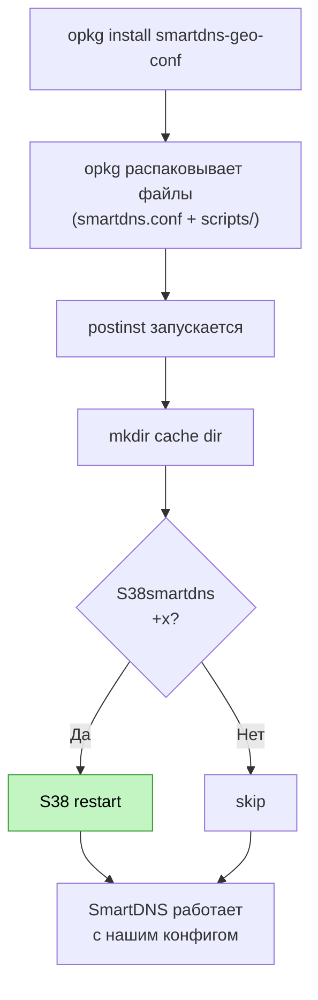

# smartdns-geo-conf — План улучшений (Phase 3)

**Version:** v1.1
**Created:** 2026-04-16
**Updated:** 2026-04-16
**Status:** ✅ Этапы A+B реализованы, ⏳ Этап C — pending
**Входные данные:**
- [Phase 1: Assessment](archive/current-state-assessment.md)
- [Phase 2: DNS Research](dns-landscape-research.md)
- [`.project/target-arch.md`](../../.project/target-arch.md), [`.project/target-code.md`](../../.project/target-code.md)

---

## Статус реализации

| Этап | Статус | Дата | Примечания |
|------|--------|------|------------|
| **A: Packaging + Init** | ✅ Готово | 2026-04-16 | `.ipk` собирается, деплой через `opkg install` работает |
| **B: Конфиг улучшения** | ✅ Готово | 2026-04-16 | DoH вместо DoT для international, TLS verify, кэш |
| **C: VPN-интеграция** | ⏳ Pending | — | Ждёт настройки VPN на роутере |

### Отклонения от плана

- **S60smartdns → S38smartdns**: вместо замены init-скрипта решено использовать стоковый `S38smartdns` из пакета `smartdns`. `postinst` перезапускает через `S38`, `prerm`/`postrm` корректно чистят. `S60smartdns` и `rootfs/` не используются.
- **International DNS**: plain UDP и DoT убраны — используется только DoH (порт 443), стабильнее через ТСПУ.
- **`restart-on-crash`**: отключён в конфиге (см. BUG-6 ниже).

### Баги, найденные при деплое

| ID | Описание | Статус | Workaround |
|----|----------|--------|------------|
| BUG-6 | `restart-on-crash yes` — SmartDNS execv() fails с relative argv[0] при запуске через S38/rc.func. Daemon не может перезапуститься. | ⚠️ Upstream bug | Закомментировано в конфиге. Перезапуск через cron или watchdog при необходимости. |
| BUG-7 | Скрипты `packaging/smartdns-geo-conf/postinst`, `prerm`, `postrm` не имели +x после сборки `.ipk` → `opkg install` не выполнял скрипты. | ✅ Исправлено | `build-ipk.sh` обновлён: `chmod +x` на все packaging-скрипты перед сборкой. |

---

## 1. Обзор

### Цель

Привести smartdns-geo-conf к уровню зрелости geo-split: `.ipk` пакетирование, надёжный init-скрипт, актуальная конфигурация DNS, автоматизированный деплой.

### Принципы

- **Инкрементальность**: три этапа, каждый независимо деплоится и тестируется
- **Простота 90%+** (`.project/target-arch.md`): минимум абстракций, прямолинейные скрипты
- **Over-engineering ≤5%**: без domain-set, без DNAT, без сложных обёрток — пока не нужно
- **Обратная совместимость**: SmartDNS продолжает работать во время и после каждого этапа

### Метрики до/после

| Метрика | До | После (цель) |
|---------|-----|---------------|
| Architecture Score | ~55% | ~90% |
| Deployment Maturity | ~30% | ~95% |
| Config Quality | ~80% | ~95% |
| Code Quality | ~92% | ~95% |

---

## 2. Этапы

```
Этап A: Packaging + Init     ← минимальный viable для .ipk
Этап B: Конфиг улучшения     ← best practices DNS
Этап C: VPN-интеграция        ← опционально, если VPN настроен
```

Каждый этап — отдельный коммит/PR, тестируемый независимо.

---

## 3. Этап A: Packaging + Init (Critical Fixes)

**Цель:** smartdns-geo-conf собирается в `.ipk`, деплоится через `opkg install`, надёжно управляет S38/S60 конфликтом.

**Оценка времени:** ~3ч

### 3.1 Новые файлы

#### 3.1.1 `packaging/smartdns-geo-conf/control`

```
Package: smartdns-geo-conf
Version: 0.1.0
Architecture: all
Maintainer: 0xkee
Depends: keenetic-entware-extras, smartdns, ca-certificates
Description: SmartDNS configuration for RU zone DNS splitting on Keenetic/Entware.
 Routes .ru/.рф/.su through Russian DNS (Yandex, AdGuard),
 everything else through international DNS (Google, Cloudflare).
 Uses stock S38smartdns init script.
Section: net
Priority: optional
```

**Решения:**
- `Depends: smartdns` — opkg установит smartdns автоматически
- `Depends: ca-certificates` — нужен для TLS verify (убираем `-k`)
- `Version: 0.1.0` — первый релиз
- Без `Recommends: geo-split` — smartdns-geo-conf работает самостоятельно

#### 3.1.2 `packaging/smartdns-geo-conf/conffiles`

```
/opt/etc/smartdns/smartdns.conf
```

Защищает конфиг от перезаписи при `opkg upgrade`. opkg спросит пользователя при конфликте.

#### 3.1.3 `packaging/smartdns-geo-conf/postinst`

```sh
#!/opt/bin/sh
# postinst — runs after package files are unpacked.
# Must be idempotent (called on both install and upgrade).
set -eu

S38="/opt/etc/init.d/S38smartdns"

# 1. Create cache directory for persistent cache
mkdir -p /opt/var/cache/smartdns

# 2. Restart SmartDNS with updated config via stock S38
if [ -x "$S38" ]; then
    "$S38" restart || true
fi

echo "smartdns-geo-conf installed. Config: /opt/etc/smartdns/smartdns.conf"
echo "Status: /opt/keenetic-entware-extras/smartdns-geo-conf/scripts/status.sh"
```

**Решение: используем стоковый S38smartdns**

Вместо кастомного S60 init-скрипта используется стоковый S38 из пакета `smartdns`. Преимущества:
- Нет конфликта S38/S60
- Нет необходимости в guard-логике
- opkg upgrade smartdns не ломает init

#### 3.1.4 `packaging/smartdns-geo-conf/prerm`

```sh
#!/opt/bin/sh
# prerm — runs before package files are removed.
set -eu

S38="/opt/etc/init.d/S38smartdns"

# Stop SmartDNS
if [ -x "$S38" ]; then
    "$S38" stop 2>/dev/null || true
fi
```

#### 3.1.5 `packaging/smartdns-geo-conf/postrm`

```sh
#!/opt/bin/sh
# postrm — runs after package files are removed.
# Cleans up empty directories and runtime files.
set -eu

# Remove runtime files
rm -f /opt/var/run/smartdns.pid
rm -f /opt/var/cache/smartdns.cache

# Remove empty directories left by opkg
for d in config scripts docs; do
    rmdir "/opt/keenetic-entware-extras/smartdns-geo-conf/$d" 2>/dev/null || true
done
rmdir "/opt/keenetic-entware-extras/smartdns-geo-conf" 2>/dev/null || true
```

#### 3.1.5 `smartdns-geo-conf/scripts/status.sh`

Диагностический скрипт (по аналогии с geo-split).

```sh
#!/opt/bin/sh
# Show SmartDNS status: process, ports, config, DNS test.
set -eu

PIDFILE="/opt/var/run/smartdns.pid"
CONF="/opt/etc/smartdns/smartdns.conf"

echo "=== SmartDNS Status ==="

# Process
if [ -f "$PIDFILE" ]; then
    pid="$(cat "$PIDFILE" 2>/dev/null)" || true
    if [ -n "$pid" ] && kill -0 "$pid" 2>/dev/null; then
        mem="$(awk '/VmRSS/{print $2}' "/proc/$pid/status" 2>/dev/null || echo "?")"
        echo "Process: running (pid $pid, RSS ${mem}kB)"
    else
        echo "Process: NOT running (stale pidfile)"
    fi
else
    pid="$(pidof smartdns 2>/dev/null || true)"
    if [ -n "$pid" ]; then
        echo "Process: running (pid $pid, no pidfile)"
    else
        echo "Process: NOT running"
    fi
fi

# Init scripts
echo ""
echo "=== Init Scripts ==="
for f in /opt/etc/init.d/S*smartdns*; do
    [ -e "$f" ] || continue
    if [ -x "$f" ]; then
        echo "  $f [ACTIVE]"
    else
        echo "  $f [disabled]"
    fi
done

# Ports
echo ""
echo "=== Listening Ports ==="
netstat -tlnup 2>/dev/null | grep -E "smartdns|:6053|:6153" || echo "  (none found)"

# Config
echo ""
echo "=== Config ==="
if [ -f "$CONF" ]; then
    echo "  File: $CONF"
    groups="$(grep -c '^server' "$CONF" 2>/dev/null || echo 0)"
    echo "  Upstream servers: $groups"
    rules="$(grep -c '^nameserver' "$CONF" 2>/dev/null || echo 0)"
    echo "  Routing rules: $rules"
else
    echo "  Config NOT found: $CONF"
fi

# DNS test (if dig available)
if command -v dig >/dev/null 2>&1; then
    echo ""
    echo "=== DNS Tests ==="
    # RU domain via main port
    result="$(dig +short +time=3 yandex.ru @127.0.0.1 -p 6053 2>/dev/null || echo "FAILED")"
    echo "  yandex.ru @:6053 → $result"
    # International domain
    result="$(dig +short +time=3 google.com @127.0.0.1 -p 6053 2>/dev/null || echo "FAILED")"
    echo "  google.com @:6053 → $result"
fi

# Cache
echo ""
echo "=== Cache ==="
if [ -f /opt/var/cache/smartdns.cache ]; then
    size="$(ls -lh /opt/var/cache/smartdns.cache 2>/dev/null | awk '{print $5}')"
    echo "  Persistent cache: $size"
else
    echo "  Persistent cache: not found"
fi
```

### 3.2 Изменения в существующих файлах

#### 3.2.1 `scripts/build-ipk.sh` — добавить smartdns-geo-conf

Добавить секцию `build_smartdns_ru()` по образцу `build_geo_split()`:

```
# smartdns-geo-conf → /opt/keenetic-entware-extras/smartdns-geo-conf/
SMARTDNS_DATA=(config scripts docs README.md)
```

Функция `build_smartdns_ru`:
- Копировать `SMARTDNS_DATA` в `data_dir/opt/keenetic-entware-extras/smartdns-geo-conf/`
- Копировать `smartdns.conf` → `data_dir/opt/etc/smartdns/smartdns.conf`
- Собрать control.tar.gz из `packaging/smartdns-geo-conf/`

Добавить в `case`: `smartdns-geo-conf) build_smartdns_ru ;;` и в `all)`.

> **Реализация:** `install.sh` и `uninstall.sh` удалены — установка/удаление через `.ipk` (`opkg install`/`opkg remove`).

### 3.3 Структура файлов после Этапа A

```
smartdns-geo-conf/
├── .project/
│   ├── target-arch.md              # обновить Deploy Layout
│   └── target-code.md
├── config/
│   └── smartdns.conf               # (обновляется в Этапе B)
├── docs/
│   ├── archive/
│   │   └── current-state-assessment.md
│   ├── dns-landscape-research.md
│   └── improvement-plan.md         # этот файл
├── scripts/
│   └── status.sh                    # 🆕 диагностика
└── README.md

packaging/
└── smartdns-geo-conf/                     # 🆕 весь каталог
    ├── control
    ├── conffiles
    ├── postinst
    ├── prerm
    └── postrm
```

### 3.4 Порядок действий Этапа A

1. Создать `packaging/smartdns-geo-conf/` (5 файлов)
2. Создать `smartdns-geo-conf/scripts/status.sh`
3. Обновить `scripts/build-ipk.sh` (добавить smartdns-geo-conf)
4. Обновить `smartdns-geo-conf/.project/target-arch.md` (Deploy Layout)
5. Тест: `./scripts/build-ipk.sh smartdns-geo-conf` — .ipk собирается

### 3.5 Init-скрипт: используем стоковый S38

Вместо кастомного S60smartdns решено использовать стоковый S38smartdns из пакета `smartdns`.



**Преимущества:**
- Нет конфликта S38/S60 — один init-скрипт
- opkg upgrade smartdns не ломает init (S38 обновляется штатно)
- Нет необходимости в guard-логике, mv/rename, header guard

---

## 4. Этап B: Конфиг улучшения (Best Practices)

**Цель:** актуальные upstream серверы, TLS security, оптимальные параметры кэша и логов.

**Оценка времени:** ~1.5ч

### 4.1 Изменения в `smartdns-geo-conf/config/smartdns.conf`

Полностью заменить содержимое. Два режима foreign DNS (A: без VPN, B: через VPN) — оба в одном файле, Mode B закомментирован.

**Финальный конфиг (базовый, Mode A — без VPN):**

```conf
############################################
# SmartDNS — DNS-сервер с разделением по группам
#
# Проект: smartdns-geo-conf (keenetic-entware-extras)
# Документация: https://pymumu.github.io/smartdns/
# GitHub:       https://github.com/pymumu/smartdns
############################################

server-name smartdns

# ===========================================================================
# Listen
# ===========================================================================

# Main port: all DNS clients via Keenetic ndnproxy → :6053
bind 0.0.0.0:6053

# geo-split port: return ALL IPs without speed-check (for update-domains.sh)
bind 0.0.0.0:6153 -no-speed-check -no-cache

# ===========================================================================
# Cache
# ===========================================================================

cache-size 20000
cache-persist yes
cache-file /opt/var/cache/smartdns.cache
prefetch-domain yes
serve-expired yes
serve-expired-ttl 259200
serve-expired-prefetch-time 21600

# ===========================================================================
# TTL & Response
# ===========================================================================

rr-ttl-min 60
rr-ttl-max 86400
speed-check-mode ping,tcp:80,tcp:443

# ===========================================================================
# IP selection
# ===========================================================================

# geo-split needs all A-records, not just fastest
max-reply-ip-num 16

# IPv4 only (no IPv6 from ISP)
force-AAAA-SOA yes

# Block HTTPS/SVCB records (type 65) — not needed on router
force-qtype-SOA 65

# ===========================================================================
# Reliability
# ===========================================================================

restart-on-crash yes

# ===========================================================================
# Logging
# ===========================================================================

log-level error
log-file /opt/var/log/smartdns.log
log-size 128K
log-num 2

# ===========================================================================
# 🇷🇺 Russian DNS — Yandex (primary) + AdGuard non-filtering (secondary)
#
# DoT к российским серверам стабилен — ТСПУ не блокирует.
# UDP fallback для надёжности.
# ===========================================================================

# Yandex DoT (базовый, без фильтрации)
server-tls 77.88.8.8:853 -group ru -exclude-default-group \
    -host-name common.dot.dns.yandex.net \
    -tls-host-verify common.dot.dns.yandex.net

server-tls 77.88.8.1:853 -group ru -exclude-default-group \
    -host-name common.dot.dns.yandex.net \
    -tls-host-verify common.dot.dns.yandex.net

# AdGuard Non-filtering DoT
server-tls 94.140.14.140:853 -group ru -exclude-default-group \
    -host-name unfiltered.adguard-dns.com \
    -tls-host-verify unfiltered.adguard-dns.com

server-tls 94.140.14.141:853 -group ru -exclude-default-group \
    -host-name unfiltered.adguard-dns.com \
    -tls-host-verify unfiltered.adguard-dns.com

# UDP fallback (Yandex only — достаточно для надёжности)
server 77.88.8.8 -group ru -exclude-default-group
server 77.88.8.1 -group ru -exclude-default-group

# ===========================================================================
# 🌍 International DNS — Google + Cloudflare (default group)
#
# Mode A: Direct (без VPN) — для non-RKN доменов этого достаточно.
# Mode B: VPN-protected — раскомментировать ниже, закомментировать Mode A.
# ===========================================================================

# --- Mode A: Direct (без VPN) ---

# Google UDP (primary — most reliable from RU)
server 8.8.8.8
server 8.8.4.4

# Cloudflare UDP (secondary)
server 1.1.1.1
server 1.0.0.1

# Cloudflare DoH (additional — may bypass DPI better than DoT)
server-https https://cloudflare-dns.com/dns-query \
    -host-name cloudflare-dns.com \
    -http-host cloudflare-dns.com \
    -host-ip 1.1.1.1 \
    -tls-host-verify cloudflare-dns.com

# --- Mode B: VPN-protected (раскомментировать если VPN настроен) ---
# Замените nwg0 на имя вашего VPN-интерфейса.
# Проверить: ip link show | grep -E 'nwg|ovpn|l2tp'
#
# server 8.8.8.8 -interface nwg0
# server 8.8.4.4 -interface nwg0
# server 1.1.1.1 -interface nwg0
# server 1.0.0.1 -interface nwg0
#
# Fallback без VPN (если VPN down — DNS всё равно работает)
# server 8.8.8.8 -fallback
# server 8.8.4.4 -fallback

# ===========================================================================
# 🇷🇺 RU routing rules — какие домены идут через ru-группу
# ===========================================================================

# Russian TLDs
nameserver /.ru/ru
nameserver /.xn--p1ai/ru
nameserver /.su/ru

# Russian services on .com/.net (CDN geo-optimization)
nameserver /yandex.net/ru
nameserver /yandex.com/ru
nameserver /vk.com/ru
nameserver /sberbank.com/ru
nameserver /tinkoff.com/ru
############################################
```

### 4.2 Diff текущий → новый конфиг

| # | Изменение | Строки | Причина |
|---|-----------|--------|---------|
| 1 | `server-name smartdns` | ➕ | Идентификация сервера |
| 2 | `bind :6153 -no-cache` | ✏️ | Добавлен `-no-cache` — geo-split не нужен кэш |
| 3 | `cache-persist yes` + `cache-file` | ➕ | Кэш выживает перезагрузку |
| 4 | `serve-expired-ttl` 86400→259200 | ✏️ | 3 дня вместо 1 (best practice) |
| 5 | `serve-expired-prefetch-time` 86400→21600 | ✏️ | 6ч вместо 24ч (оптимальнее) |
| 6 | `rr-ttl-min 60` + `rr-ttl-max 86400` | ➕ | TTL bounds |
| 7 | `speed-check-mode ping,tcp:80,tcp:443` | ➕ | Явный выбор IP по скорости |
| 8 | `force-qtype-SOA 65` | ➕ | Блокировка HTTPS/SVCB records |
| 9 | `restart-on-crash yes` | ➕ | Авто-рестарт при падении |
| 10 | `log-file` + `log-size` + `log-num` | ➕ | Ротация логов, явный путь |
| 11 | Yandex hostname: `dns.yandex.ru` → `common.dot.dns.yandex.net` | ✏️ | 🔴 Устаревший hostname |
| 12 | AdGuard IP: 94.140.14.14/15 → 94.140.14.140/141 | ✏️ | 🔴 Были default+family, нужен unfiltered |
| 13 | AdGuard hostname: `dns-unfiltered.adguard.com` → `unfiltered.adguard-dns.com` | ✏️ | 🔴 Актуальный hostname |
| 14 | Убран `-k` со всех серверов | ✏️ | 🔴 TLS verify обязательна |
| 15 | Убран Cloudflare DoT (:853) | ❌ | Порт 853 блокируется ТСПУ |
| 16 | Добавлены Cloudflare/Google UDP | ➕ | Надёжный fallback |
| 17 | Добавлен Cloudflare DoH с `-host-ip` | ✏️ | Убран `-bootstrap-dns`, добавлен `-host-ip` |
| 18 | Убраны AdGuard UDP fallback | ❌ | Yandex UDP достаточно для ru-группы |
| 19 | Убраны gov.ru/nalog.ru/etc | ❌ | Покрыты /.ru/ru |
| 20 | Добавлены vk.com/sberbank.com/etc | ➕ | CDN geo-optimization |
| 21 | Mode B (VPN) закомментирован | ➕ | Готов к Этапу C |

### 4.3 Порядок действий Этапа B

1. Заменить содержимое `smartdns-geo-conf/config/smartdns.conf`
2. Проверить shellcheck скрипты (не затрагиваются, но на всякий случай)
3. Пересобрать: `./scripts/build-ipk.sh smartdns-geo-conf`
4. Деплой + тест DNS (dig yandex.ru, dig google.com)

---

## 5. Этап C: VPN-интеграция (опционально)

**Цель:** foreign DNS запросы идут через VPN-туннель, обходя ТСПУ-спуфинг.

**Оценка времени:** ~0.5ч (конфиг) + тестирование

### 5.1 Когда нужен

- VPN (WireGuard/OpenVPN) настроен на роутере
- Нужен доступ к заблокированным `.com` доменам с правильным DNS
- ISP применяет DNS-спуфинг (ТСПУ подменяет ответы для доменов из реестра РКН)

### 5.2 Что делать

В `smartdns.conf`:
1. Закомментировать блок `Mode A: Direct`
2. Раскомментировать блок `Mode B: VPN-protected`
3. Заменить `nwg0` на имя VPN-интерфейса

Проверить имя интерфейса:
```sh
ip link show | grep -E 'nwg|ovpn|l2tp'
```

### 5.3 Тестирование VPN-режима

```sh
# 1. Проверить что VPN поднят
ip link show nwg0

# 2. Тест DNS через VPN
dig google.com @127.0.0.1 -p 6053 +short

# 3. Тест заблокированного домена (если есть)
dig <blocked-domain.com> @127.0.0.1 -p 6053 +short
# Должен вернуть реальный IP, не IP-заглушку РКН

# 4. Тест RU домена (должен идти напрямую, не через VPN)
dig yandex.ru @127.0.0.1 -p 6053 +short
```

### 5.4 Rollback

Если VPN нестабилен — закомментировать Mode B, раскомментировать Mode A. Fallback-серверы без `-interface` гарантируют что DNS работает даже при упавшем VPN.

---

## 6. Список всех файлов (summary)

### Новые файлы (6)

| Файл | Этап | Описание |
|------|------|----------|
| `packaging/smartdns-geo-conf/control` | A | Метаданные пакета |
| `packaging/smartdns-geo-conf/conffiles` | A | Защита smartdns.conf |
| `packaging/smartdns-geo-conf/postinst` | A | Создание cache dir, restart S38 |
| `packaging/smartdns-geo-conf/prerm` | A | Остановка SmartDNS |
| `packaging/smartdns-geo-conf/postrm` | A | Очистка runtime-файлов и директорий |
| `smartdns-geo-conf/scripts/status.sh` | A | Диагностика SmartDNS |

### Изменяемые файлы (2)

| Файл | Этап | Что меняется |
|------|------|--------------|
| `scripts/build-ipk.sh` | A | Добавить build_smartdns_ru() |
| `smartdns-geo-conf/config/smartdns.conf` | B | Полное обновление конфига |

### Удалённые файлы (3)

| Файл | Причина |
|------|---------|
| `smartdns-geo-conf/scripts/install.sh` | Заменён на `.ipk` установку через `opkg` |
| `smartdns-geo-conf/scripts/uninstall.sh` | Заменён на `opkg remove smartdns-geo-conf` |
| `smartdns-geo-conf/rootfs/opt/etc/init.d/S60smartdns` | Используется стоковый S38 |

### Обновляемые docs (1)

| Файл | Этап | Что меняется |
|------|------|--------------|
| `smartdns-geo-conf/.project/target-arch.md` | A | Deploy Layout + packaging |

---

## 7. Оценка effort

| Этап | Задачи | Время | Блокируется |
|------|--------|-------|-------------|
| **A: Packaging + Init** | 6 новых + 2 изменённых файла | ~3ч | Ничем |
| **B: Конфиг** | 1 файл (smartdns.conf) | ~1.5ч | Этап A (нужен .ipk для деплоя) |
| **C: VPN** | Раскомментировать 6 строк | ~0.5ч | Этап B + VPN на роутере |
| **Итого** | | **~5ч** | |

---

## 8. Риски и митигация

| Риск | Вероятность | Влияние | Митигация |
|------|------------|---------|-----------|
| TLS verify без `-k` не работает | Средняя | DNS не резолвится через DoT | `ca-certificates` в Depends; fallback на UDP |
| S38 обновляется при opkg upgrade smartdns | Низкая | SmartDNS перезапустится с новым S38 | Наш конфиг остаётся (conffiles), S38 штатный |
| VPN down → foreign DNS не работает | Низкая (Mode B) | Зарубежные домены не резолвятся | Fallback-серверы без `-interface` |
| `cache-persist` на flash → износ | Очень низкая | Уменьшение ресурса flash | Кэш ~2MB, запись 1 раз при shutdown |
| Конфиг drift после ручных правок | Средняя | Рассинхронизация | `conffiles` — opkg предупредит |

---

## 9. Acceptance Criteria

### Этап A ✅

- [x] `./scripts/build-ipk.sh smartdns-geo-conf` — собирает .ipk без ошибок
- [x] .ipk содержит: smartdns.conf, scripts/, packaging scripts
- [x] `shellcheck -x -s sh` — чисто на всех .sh файлах
- [x] S38smartdns (стоковый): start/stop/restart работают
- [x] postinst перезапускает SmartDNS через S38
- [x] prerm останавливает SmartDNS, postrm чистит runtime-файлы

> **Отклонение:** используется стоковый S38 вместо кастомного S60 (см. "Отклонения от плана" выше).

### Этап B ✅

- [x] Yandex DoT hostname = `common.dot.dns.yandex.net`
- [x] AdGuard IP = 94.140.14.140/141, hostname = `unfiltered.adguard-dns.com`
- [x] Нет флага `-k` ни на одном сервере
- [x] `dig yandex.ru @127.0.0.1 -p 6053` — резолвится
- [x] `dig google.com @127.0.0.1 -p 6053` — резолвится
- [x] Логи пишутся в `/opt/var/log/smartdns.log`, ротация настроена

### Этап C ⏳

- [ ] `dig google.com @127.0.0.1 -p 6053` через VPN — возвращает правильный IP
- [ ] При VPN down — fallback серверы отвечают
