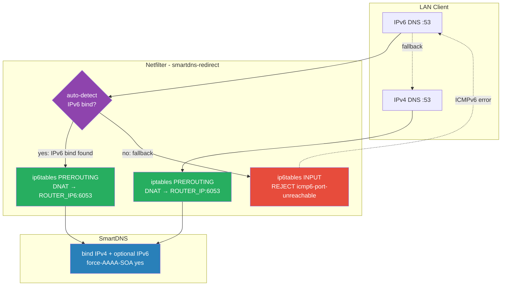

# Fix Design: IPv6 DNS Leak Prevention (v3)

**Date:** 2026-07-26
**Bug:** [dns-leak-analysis.md](../../docs/bugs/nikolay1980/dns-leak-analysis.md)
**Status:** ✅ Design approved
**Affects packages:** smartdns-redirect, smartdns-geo-conf

---

## Problem

`smartdns-redirect` перехватывает только IPv4 DNS (iptables DNAT). IPv6 DNS проходит через ndnproxy `:::53` → стоковые DoH/DoT → leak.

---

## Why Geo Zones Do NOT Fix This

DNS leak происходит на **уровне netfilter** (Level 1), до того как SmartDNS или geo-split вовлечены:

```
Level 1: CLIENT → NETFILTER (smartdns-redirect)
  IPv4 → iptables DNAT → SmartDNS ✅
  IPv6 → нет правил → ndnproxy → DoH/DoT → LEAK ❌

Level 2: SmartDNS → UPSTREAM (smartdns-geo-conf)
  .ru → Yandex DoT (zone group)
  * → Google DoH (default group)

Level 3: CLIENT → DATA (geo-split)
  ip rule → table 1000/1001 → ISP/Tunnel
```

Даже при определённой geo-зоне IPv6 DNS **не доходит до SmartDNS**. Fix только на Level 1.

---

## Solution: Fully Automatic IPv6 Handling

**Нет пользовательских опций** для IPv6 DNS. Поведение автоматическое:

| Условие | Действие | Результат |
|---------|----------|-----------|
| SmartDNS IPv6 bind + br0 global IPv6 | ip6tables DNAT → SmartDNS | Полный IPv6 DNS через SmartDNS |
| Нет IPv6 bind или нет IPv6 на br0 | ip6tables INPUT REJECT | Instant fallback на IPv4 → DNAT → SmartDNS |

**Дополнительно: BLOCK_DIRECT** — отдельные опции для блокировки прямых DNS на FORWARD chain (safety net, в TODO по запросу).

---

## Packet Flow

### With IPv6 (auto-DNAT)

```
IPv4:  Client → :53 → PREROUTING DNAT → SmartDNS:6053           ← existing
IPv6:  Client → :53 → PREROUTING DNAT → [ROUTER_IP6]:6053       ← NEW
```

### Without IPv6 (auto-REJECT fallback)

```
IPv4:  Client → :53 → PREROUTING DNAT → SmartDNS:6053           ← existing
IPv6:  Client → :53 → INPUT REJECT (icmp6-port-unreachable)     ← NEW
       Client → instant IPv4 fallback → SmartDNS via DNAT        ← Happy Eyeballs
```

---

## Architecture Diagram



---

## Auto-Detection Logic

```sh
# Can we DNAT IPv6 DNS to SmartDNS?
can_dnat_ipv6() {
    command -v ip6tables >/dev/null 2>&1 || return 1
    ROUTER_IP6="$(detect_router_ip6)"
    [ -n "$ROUTER_IP6" ] || return 1
    # SmartDNS IPv6 bind (managed by smartdns-geo-conf postinst)
    grep -q 'bind \[' /opt/etc/smartdns/bind-addrs.conf 2>/dev/null || return 1
    return 0
}
```

---

## Separation of Concerns

| Package | Ответственность | Изменения |
|---------|-----------------|-----------|
| **smartdns-geo-conf** | SmartDNS IPv6 bind в bind-addrs.conf | postinst: detect IPv6 → add bind |
| **smartdns-redirect** | ip6tables auto-DNAT или auto-REJECT | dns-redirect.sh, watchdog.sh, status.sh |
| **lib** | `detect_router_ip6()` helper | common.sh |

---

## File Changes

| File | Change |
|------|--------|
| [`lib/common.sh`](../../lib/common.sh:51) | Add `detect_router_ip6()` |
| [`smartdns-redirect/config/defaults.conf`](../config/defaults.conf:14) | Remove `ENABLE_IPV6=no` |
| [`smartdns-redirect/scripts/dns-redirect.sh`](../scripts/dns-redirect.sh:1) | Auto-detect IPv6, DNAT/REJECT, backwards compat shim |
| [`smartdns-redirect/scripts/watchdog.sh`](../scripts/watchdog.sh:1) | Check IPv6 rules (DNAT or REJECT) |
| [`smartdns-redirect/scripts/status.sh`](../scripts/status.sh:1) | Display IPv6 mode in text + JSON |
| [`smartdns-geo-conf/init.d/S37smartdns-conf`](../../smartdns-geo-conf/init.d/S37smartdns-conf) | IPv6 bind detection via `do_bind_addrs()` |
| [`packaging/smartdns-redirect/control`](../../packaging/smartdns-redirect/control) | Version bump MINOR |
| [`packaging/smartdns-geo-conf/control`](../../packaging/smartdns-geo-conf/control) | Version bump PATCH |

---

## Key Implementation Details

### dns-redirect.sh — add_rules()

```sh
add_rules() {
    local iface proto

    # IPv4 DNAT (existing, unchanged)
    for iface in $INTERFACES; do
        for proto in udp tcp; do
            add_rule_if_missing "$iface" "$proto"
        done
    done

    # IPv6 — fully automatic
    if command -v ip6tables >/dev/null 2>&1; then
        if can_dnat_ipv6; then
            for iface in $INTERFACES; do
                for proto in udp tcp; do
                    add_v6_dnat_rule "$iface" "$proto"
                done
            done
            log "IPv6 DNS: DNAT to [${ROUTER_IP6}]:${UPSTREAM_PORT}"
        else
            for iface in $INTERFACES; do
                for proto in udp tcp; do
                    add_v6_reject_input "$iface" "$proto"
                done
            done
            log "IPv6 DNS: REJECT on INPUT (no IPv6 DNAT target)"
        fi
    fi
}
```

### del_all_rules() — comprehensive cleanup

```sh
del_all_rules() {
    # IPv4 nat PREROUTING (existing)
    _cleanup_chain iptables nat PREROUTING "DNAT|REDIRECT"

    if command -v ip6tables >/dev/null 2>&1; then
        # IPv6 nat PREROUTING (DNAT mode)
        _cleanup_chain ip6tables nat PREROUTING "DNAT|REDIRECT"
        # IPv6 filter INPUT (REJECT mode)
        _cleanup_chain ip6tables filter INPUT "REJECT.*--dport 53"
    fi
}
```

### smartdns-geo-conf postinst — IPv6 bind

```sh
ROUTER_IP6="$(detect_router_ip6)"
if [ -n "$ROUTER_IP6" ]; then
    cat >> "$BIND_ADDRS_CONF" <<EOF

# IPv6 bind (auto-detected)
bind [::1]:6053
bind-tcp [::1]:6053
bind [${ROUTER_IP6}]:6053
bind-tcp [${ROUTER_IP6}]:6053
EOF
else
    cat >> "$BIND_ADDRS_CONF" <<EOF

# IPv6 loopback only (no global IPv6 detected)
bind [::1]:6053
bind-tcp [::1]:6053
EOF
fi
```

### Backwards Compatibility

```sh
# In dns-redirect.sh — ignore legacy ENABLE_IPV6
if [ "${ENABLE_IPV6:-}" = "yes" ]; then
    log "ENABLE_IPV6 is deprecated and ignored. IPv6 is now automatic."
fi
```

---

## Testing Checklist

- [ ] Auto-DNAT: IPv6 bind + br0 IPv6 → ip6tables DNAT rules present
- [ ] Auto-REJECT: no IPv6 bind → ip6tables INPUT REJECT rules present
- [ ] `dig @<router-ipv6> -p 53 example.com` → SmartDNS answer (DNAT) or refused (REJECT)
- [ ] DNS leak test (dnscheck.tools) — no extra resolvers after 30 min
- [ ] `dns-redirect.sh stop` — all IPv6 rules removed
- [ ] `dns-redirect.sh reload` — IPv6 rules restored
- [ ] Watchdog detects missing IPv6 rules
- [ ] NDM hook restores IPv6 rules
- [ ] `ENABLE_IPV6=yes` in config.conf → warning, ignored
- [ ] `status` text + JSON: shows IPv6 mode (dnat/reject)

---

## TODO: BLOCK_DIRECT (by request)

Future enhancement — separate from core IPv6 fix:

```sh
# defaults.conf (not yet implemented)
BLOCK_DIRECT_IPV4=no    # iptables FORWARD REJECT :53
BLOCK_DIRECT_IPV6=yes   # ip6tables FORWARD REJECT :53
```

Blocks transit DNS on FORWARD chain — safety net against:
- NDM flush race condition
- Hardcoded external DNS (8.8.8.8, 2001:4860:4860::8888)
- Non-configured interfaces

Safe: router's own DNS (SmartDNS→upstream, ndnproxy) uses OUTPUT chain, not FORWARD.

---

## Implementation Order

1. `lib/common.sh` — `detect_router_ip6()`
2. `smartdns-geo-conf/packaging/postinst` — IPv6 bind
3. `smartdns-redirect/config/defaults.conf` — remove `ENABLE_IPV6`
4. `smartdns-redirect/scripts/dns-redirect.sh` — auto IPv6 DNAT/REJECT
5. `smartdns-redirect/scripts/watchdog.sh` — check IPv6 rules
6. `smartdns-redirect/scripts/status.sh` — display IPv6 mode
7. Version bumps + CHANGELOG
8. Deploy + test
