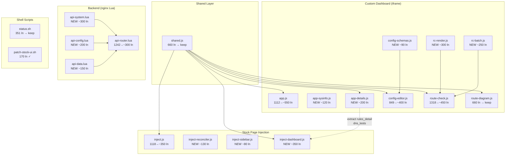

# Modular Assessment — webui

**Version:** 1.0  
**Date:** 2025-08-11  
**Scope:** `webui/` subproject (static JS/CSS, Lua, shell scripts)  
**Method:** Fuzzy logic modularity analysis (5 phases)

---

## Executive Summary

| Metric | Value |
|--------|-------|
| Total source files | 26 (11 JS, 4 CSS, 2 HTML, 3 Lua, 4 sh, 2 conf) |
| Total lines | 9,979 |
| God modules (>3 concerns) | **5** — `api-router.lua`, `app.js`, `inject.js`, `route-check.js`, `config-editor.js` |
| Largest file | `route-check.js` — 1,318 lines |
| Largest function | `DOMContentLoaded` handler in `app.js` — ~270 lines |
| Scattered concerns | **2** — rules_detail rendering, DNS tests rendering |
| Files exceeding target | 6 of 13 logic files (46%) |

**Top 3 problems:**
1. **`api-router.lua`** (1,242 lines, 11 concerns) — single-file monolith handling system info, interfaces, clients, config CRUD, zones, DNS providers, diagnostics, caching, validation, routing dispatch
2. **Duplicated rendering** — `rules_detail` + `dns_tests` HTML construction is copy-pasted between `app.js` and `inject.js` (~80 lines each)
3. **`app.js` DOMContentLoaded** (270 lines) — mixes config-editor event delegation, UI init, polling setup, hash routing in one handler

---

## Target Compliance Table

Size targets adapted from `.project/target-code.md` (shell-focused):
- JS/Lua library modules: ≤300 lines (analog of `lib/*.sh`)
- Self-contained command modules: ≤400 lines (analog of `cmd-*.sh`)
- Functions: ≤50 lines
- Over-engineering tolerance: 5%

| Metric | Target | Current | Gap | Status |
|--------|--------|---------|-----|--------|
| Max file size (JS/Lua) | ≤300 ln | 1,318 ln (`route-check.js`) | +1,018 | 🔴 |
| Max function size | ≤50 ln | ~270 ln (`DOMContentLoaded`) | +220 | 🔴 |
| SRP (per file) | 1 concern | worst: 11 (`api-router.lua`) | -10 | 🔴 |
| Cohesion (avg) | ≥0.8 | 0.38 (see Phase 2) | -0.42 | 🔴 |
| God modules | 0 | 5 | -5 | 🔴 |
| Scattered concerns | 0 | 2 | -2 | 🟡 |
| Files in target | 100% | 54% (7/13) | -46% | 🔴 |
| Shell scripts in target | 100% | 50% (1/2: `patch-stock-ui.sh` ✓, `status.sh` 🟡) | -50% | 🟡 |

Status: 🟢 ≤5% gap | 🟡 5–20% gap | 🔴 >20% gap

---

## Phase 1: Atomic Concern Table

### `shared.js` (660 lines, 6 concerns)

| ID | Concern | Lines | Functions |
|----|---------|-------|-----------|
| C01 | Service Registry & Constants | ~30 | `SERVICE_APIS`, `TIMER_KEYS`, `UPDATE_ACTIONS`, `IFACE_DETAIL_KEYS`, `IFACE_SPECIAL` |
| C02 | Interface Label Management | ~170 | `loadIfaceMap`, `ifaceLabelFull`, `_ifaceLabelShort`, `_humanizeIfaceList`, `_humanizeRouteOut`, `_humanizeRulesLines`, `_humanizeGateway`, `_humanizeIfaceDetail` |
| C03 | Detail Parsing | ~140 | `parseDetails`, `formatKey`, `formatBool`, `shortDomain`, `escapeHtml` |
| C04 | Detail Rendering | ~70 | `detailValueStyle`, `renderDetailValue`, `renderUpdateBtn` |
| C05 | Timer & Polling Factories | ~130 | `createPoller`, `createTicker`, `createTogglePoller`, `formatUptimeStock` |
| C06 | Utility Functions | ~50 | `getService`, `hasFailField`, `checksSummary`, `isTunnelIface` |

### `app.js` (1,112 lines, 9 concerns)

| ID | Concern | Lines | Functions |
|----|---------|-------|-----------|
| C07 | Status Badge Rendering | ~50 | `setStatus`, `updateCardAccent` |
| C08 | Details Rendering (custom) | ~150 | `setDetails` (rules_detail, dns_tests, skeleton counts) |
| C09 | Tab Management | ~70 | `switchTab`, `applyHashRoute` |
| C10 | Fetch & Polling | ~120 | `fetchStatus`, `refreshAll`, `startAutoRefresh` |
| C11 | System Info Display | ~100 | `fetchSystemInfo`, `SYSINFO_ICONS` |
| C12 | Stock CSS Discovery | ~30 | `discoverStockCSS`, `postMessage` listener |
| C13 | UI Generation | ~100 | `buildUI` |
| C14 | Toggle Handling | ~40 | `handleToggle`, `startTogglePoller` |
| C15 | Init & Event Delegation | ~270 | `DOMContentLoaded` handler (mixed) |

### `config-editor.js` (849 lines, 6 concerns)

| ID | Concern | Lines | Functions |
|----|---------|-------|-----------|
| C16 | Config Schema Definitions | ~90 | `CONFIG_SCHEMAS`, `CONFIG_LABELS` |
| C17 | Modal Lifecycle | ~70 | `openConfigModal`, `closeConfigModal`, `modalEscHandler`, `toggleConfigEditor` |
| C18 | Dropdown Component | ~100 | `renderDropdown` |
| C19 | Form Rendering | ~220 | `renderModalForm` |
| C20 | Config Save Logic | ~150 | `saveConfig` |
| C21 | Field Reset Logic | ~140 | `handleResetField`, `handleResetAll` |

### `inject.js` (1,118 lines, 7 concerns)

| ID | Concern | Lines | Functions |
|----|---------|-------|-----------|
| C22 | Configuration & State | ~65 | `__cfg`, `CUSTOM_ITEMS`, pollers, constants |
| C23 | CDK Reconciler | ~120 | `ewReconcile`, `ewScheduleReconcile`, `ewVisible`, `ewIsCdkNoise`, `ewFindPanelRoot`, `ewGetColRows` |
| C24 | Dashboard Card DOM | ~100 | `ewPatchDashboardRow`, `ewUnpatchRow`, `buildEntwareDashboardContent`, `injectDashStyles` |
| C25 | Sidebar | ~60 | `buildSection` |
| C26 | Iframe Navigation | ~100 | `showInContent`, `removeIframe`, `sendCSSUrlToIframe`, `getStockCSSUrl`, `setupRestore` |
| C27 | Status & Polling (stock page) | ~250 | `buildServiceRow`, `fetchDashboardStatuses`, `fetchSingleServiceStatus`, `applyServiceData`, `parseServiceStatus`, `renderDetailsGrid`, `startTogglePoller`, `ewStopDashboardPolling` |
| C28 | Bootstrap & Events | ~120 | `tryInject`, MutationObserver, route watcher, drag events |

### `route-check.js` (1,318 lines, 9 concerns)

| ID | Concern | Lines | Functions |
|----|---------|-------|-----------|
| C29 | History Management | ~60 | `getHistory`, `saveToHistory`, `removeFromHistory`, `getHistoryDomains`, `renderHistoryPills` |
| C30 | Modal Factory | ~160 | `_createDiagModal`, `_openCheckModal` |
| C31 | Route Result Rendering | ~130 | `_buildRouteSummary`, `_buildRouteDetails`, `_getVerdictClass`, `_collectAllDevs` |
| C32 | DNS Result Rendering | ~60 | `_buildDnsSummary`, `_buildDnsDetails` |
| C33 | Full Result Card | ~90 | `_renderFullResult`, `_renderResults` |
| C34 | Batch Table | ~130 | `_createBatchTableEl`, `_buildBatchRowPair`, `_renderBatchTable` |
| C35 | Batch Runner | ~90 | `_runBatch` |
| C36 | Interface Loader | ~120 | `_loadInterfaces`, `_buildIfaceDropdown`, `_getSelectedIface`, `_buildRouteCheckUrl` |
| C37 | Public API & Examples | ~100 | `openRouteCheckModal`, `openDnsCheckModal`, `_renderExamples` |

### `route-diagram.js` (660 lines, 5 concerns)

| ID | Concern | Lines | Functions |
|----|---------|-------|-----------|
| C38 | SVG Helpers | ~60 | `_svgEl`, `_svgText`, `_svgPolyline`, `_svgLine` |
| C39 | Icon Definitions | ~120 | `_addIconDefs`, `_useIcon` |
| C40 | Route Diagram | ~180 | `renderRouteDiagram`, `_buildPaths` |
| C41 | DNS Diagram | ~130 | `renderDnsDiagram`, `_buildDnsGroups` |
| C42 | Error Rendering | ~15 | `_renderError` |

### `api-router.lua` (1,242 lines, 11 concerns)

| ID | Concern | Lines | Functions |
|----|---------|-------|-----------|
| C43 | Cache Infrastructure | ~50 | `cached_run`, TTL constants, lock mechanism |
| C44 | Shell/File Utilities | ~60 | `run_cmd`, `read_file`, `json_escape` |
| C45 | System Info | ~140 | `system_info`, `resolve_thermal_path`, thermal specs |
| C46 | Interface Labels (NDM) | ~170 | `get_iface_labels`, `NDM_TYPE_TO_PREFIX` |
| C47 | Interface List | ~50 | `system_interfaces` |
| C48 | Client List | ~130 | `system_clients` |
| C49 | Config CRUD | ~140 | `config_registry`, `parse_shell_config`, `read_config`, `write_config` |
| C50 | Zone & Provider Data | ~100 | `system_zones`, `system_dns_providers` |
| C51 | Route Tables & Dispatch | ~80 | `json_routes`, `action_routes`, `lua_routes`, dispatch logic |
| C52 | Input Validation | ~50 | `validate_host`, `validate_cidr`, `validate_iif`, `validate_mac` |
| C53 | Diagnostic Endpoints | ~60 | route-check, dns-check dispatch |

### `scripts/status.sh` (351 lines, 5 concerns)

| ID | Concern | Lines | Functions |
|----|---------|-------|-----------|
| C54 | Check Functions | ~90 | `check_config`, `check_listen_conf`, `check_lua_module`, `check_logrotate`, `check_upstream`, `check_patch_compat` |
| C55 | Show Functions | ~90 | `show_config`, `show_listen_conf`, `show_lua_module`, `show_logrotate`, `show_upstream`, `show_http`, `show_patch_compat` |
| C56 | JSON Output | ~60 | `json_output` |
| C57 | Text Output | ~40 | `text_output` |
| C58 | Main Flow | ~30 | Check orchestration + output dispatch |

### `scripts/patch-stock-ui.sh` (170 lines, 3 concerns)

| ID | Concern | Lines | Functions |
|----|---------|-------|-----------|
| C59 | Bundle Detection | ~50 | JS/CSS hash, patch enum detection |
| C60 | Patch Application | ~50 | `patch_sed`, `apply_patches` dispatch |
| C61 | Pre-compression | ~20 | gzip_static for bundles |

---

## Phase 2: Fuzzy Membership Matrix & Metrics

### Per-File Metrics

| File | Lines | Concerns | SRP | Cohesion | Coupling (fan-out) | Status |
|------|-------|----------|-----|----------|-------------------|--------|
| `shared.js` | 660 | 6 | 0.17 | 0.45 | 0 (consumed by all) | 🟡 Utility lib |
| `app.js` | 1,112 | 9 | 0.11 | 0.25 | 8 (shared, config-editor, route-check, route-diagram) | 🔴 God module |
| `config-editor.js` | 849 | 6 | 0.17 | 0.55 | 2 (shared, app) | 🟡 Large but cohesive |
| `inject.js` | 1,118 | 7 | 0.14 | 0.30 | 2 (shared) | 🔴 God module |
| `route-check.js` | 1,318 | 9 | 0.11 | 0.40 | 3 (shared, route-diagram) | 🔴 God module |
| `route-diagram.js` | 660 | 5 | 0.20 | 0.65 | 1 (shared) | 🟡 SVG renderer |
| `api-router.lua` | 1,242 | 11 | 0.09 | 0.15 | 5 (shell scripts, ndmc, filesystem) | 🔴 God module |
| `status.sh` | 351 | 5 | 0.20 | 0.70 | 3 (lib/common, lib/status, config) | 🟡 Slightly over |
| `patch-stock-ui.sh` | 170 | 3 | 0.33 | 0.80 | 2 (patches, config) | 🟢 |

**Average cohesion:** 0.38 (target: ≥0.8)

### Fuzzy Membership Matrix (key concerns → potential modules)

| Concern | Current File | Best Module | Membership | Alt Module | Alt Score |
|---------|-------------|-------------|------------|-----------|-----------|
| C02 Iface Labels | shared.js | shared-iface | 0.95 | — | — |
| C03 Detail Parsing | shared.js | shared-detail | 0.90 | — | — |
| C05 Timer Factories | shared.js | shared-timer | 0.85 | — | — |
| C08 Details Render | app.js | app-details | 0.85 | inject-dashboard | 0.30 |
| C11 System Info | app.js | app-sysinfo | 0.95 | — | — |
| C15 Init (mixed) | app.js | app (reduced) | 0.40 | config-editor | 0.50 |
| C23 Reconciler | inject.js | inject-reconciler | 0.95 | — | — |
| C25 Sidebar | inject.js | inject-sidebar | 0.90 | — | — |
| C27 Status/Poll | inject.js | inject-dashboard | 0.90 | — | — |
| C31 Route Results | route-check.js | rc-render | 0.90 | — | — |
| C34 Batch Table | route-check.js | rc-batch | 0.85 | — | — |
| C45 System Info (Lua) | api-router.lua | api-system | 0.95 | — | — |
| C46 Iface Labels (Lua) | api-router.lua | api-system | 0.85 | api-iface | 0.90 |
| C49 Config CRUD | api-router.lua | api-config | 0.95 | — | — |
| C50 Zones/Providers | api-router.lua | api-data | 0.90 | — | — |

### Problem Detection

**God Modules (>3 concerns):**
1. `api-router.lua` — 11 concerns, SRP=0.09, cohesion=0.15
2. `route-check.js` — 9 concerns, SRP=0.11, cohesion=0.40
3. `app.js` — 9 concerns, SRP=0.11, cohesion=0.25
4. `inject.js` — 7 concerns, SRP=0.14, cohesion=0.30
5. `config-editor.js` — 6 concerns, SRP=0.17, cohesion=0.55

**Scattered Concerns (same logic, multiple files):**
1. **rules_detail rendering** — `app.js:174-217` ↔ `inject.js:860-903` (near-identical ~40 lines)
2. **dns_tests rendering** — `app.js:219-247` ↔ `inject.js:905-929` (near-identical ~30 lines)

---

## Phase 3: Proposed Module Architecture

### Constraint: Vanilla JS (ES5), No Bundler

The webui uses `<script>` tag loading with `window.EW` namespace. "Modules" = separate `.js` files added to `index.html`. Lua modules use `require()` via `lua_package_path`.

### Architecture Diagram



### Module Specifications

#### 1. `shared.js` — KEEP (660 lines)
**Rationale:** Utility library consumed by ≥5 files. Well-organized IIFE. Relaxation: shared utility with ≥3 consumers, all exports used. Internal concerns are tightly related (all serve detail parsing/rendering pipeline).

#### 2. `app.js` → split into 3 files

| New File | Lines | Concerns | Source |
|----------|-------|----------|--------|
| `app.js` | ~550 | C07,C09,C10,C12,C13,C14 + reduced C15 | Core dashboard |
| `app-sysinfo.js` | ~120 | C11 | System info bar |
| `app-details.js` | ~200 | C08 (+ shared rules_detail/dns_tests helper) | Details rendering |

C15 (DOMContentLoaded) reduced by moving config-editor event delegation (radio_text, zone_selector, iface_select handlers ~150 lines) into `config-editor.js` as `initConfigEditorEvents()`.

#### 3. `inject.js` → split into 4 files

| New File | Lines | Concerns | Source |
|----------|-------|----------|--------|
| `inject.js` | ~350 | C22,C26,C28 | Bootstrap, iframe, events |
| `inject-reconciler.js` | ~130 | C23 | CDK row reconciler |
| `inject-sidebar.js` | ~80 | C25 | Sidebar DOM construction |
| `inject-dashboard.js` | ~350 | C24,C27 | Dashboard card + polling |

`inject-dashboard.js` imports shared `renderRulesDetail()` and `renderDnsTests()` from `app-details.js` (via EW namespace) to eliminate scattered concern.

#### 4. `config-editor.js` → split into 2 files

| New File | Lines | Concerns | Source |
|----------|-------|----------|--------|
| `config-schemas.js` | ~90 | C16 | Schema data (loaded first) |
| `config-editor.js` | ~400 | C17,C18,C19,C20,C21 + event init | Modal + form + save + reset |

Relaxation applied: self-contained command module (≤400 lines target). With schema extracted and event handlers absorbed, fits target.

#### 5. `route-check.js` → split into 3 files

| New File | Lines | Concerns | Source |
|----------|-------|----------|--------|
| `route-check.js` | ~450 | C29,C30,C36,C37 | Modal, history, interface loader, API |
| `rc-render.js` | ~300 | C31,C32,C33 | Result rendering (route + DNS) |
| `rc-batch.js` | ~250 | C34,C35 | Batch table + sequential runner |

#### 6. `route-diagram.js` — KEEP (660 lines)
**Rationale:** Self-contained SVG renderer. 5 concerns but all tightly coupled (SVG helpers → icons → diagrams). Data-heavy (icon path definitions = ~120 lines of pure data). Relaxation: data-heavy module where logic portion (~400 lines) is within target.

#### 7. `api-router.lua` → split into 4 files

| New File | Lines | Concerns | Source |
|----------|-------|----------|--------|
| `api-router.lua` | ~300 | C43,C44,C51,C52,C53 | Entry point, cache, dispatch, validation |
| `api-system.lua` | ~300 | C45,C46,C47,C48 | System info, interfaces, clients |
| `api-config.lua` | ~200 | C49 | Config registry, read/write |
| `api-data.lua` | ~150 | C50 | Zones, DNS providers |

Uses Lua `require()` — already supported via `lua_package_path` in nginx.conf.

#### 8. `status.sh` — KEEP (351 lines)
**Rationale:** 17% over 300-line target. 🟡 Acceptable: all 5 concerns are check→show pairs for the same service, tightly cohesive. Splitting would create files <80 lines each.

### Post-Refactor Size Map

| Module | Current | Proposed | In Target? |
|--------|---------|----------|-----------|
| `shared.js` | 660 | 660 | 🟡 utility lib |
| `app.js` | 1,112 | ~550 | 🟡 command |
| `app-sysinfo.js` | — | ~120 | 🟢 |
| `app-details.js` | — | ~200 | 🟢 |
| `config-schemas.js` | — | ~90 | 🟢 |
| `config-editor.js` | 849 | ~400 | 🟢 command |
| `inject.js` | 1,118 | ~350 | 🟢 |
| `inject-reconciler.js` | — | ~130 | 🟢 |
| `inject-sidebar.js` | — | ~80 | 🟢 |
| `inject-dashboard.js` | — | ~350 | 🟢 |
| `route-check.js` | 1,318 | ~450 | 🟡 command |
| `rc-render.js` | — | ~300 | 🟢 |
| `rc-batch.js` | — | ~250 | 🟢 |
| `route-diagram.js` | 660 | 660 | 🟡 data-heavy |
| `api-router.lua` | 1,242 | ~300 | 🟢 |
| `api-system.lua` | — | ~300 | 🟢 |
| `api-config.lua` | — | ~200 | 🟢 |
| `api-data.lua` | — | ~150 | 🟢 |

**Files in target:** 14/18 = 78% (from 54%)  
**God modules:** 0 (from 5)  
**Scattered concerns:** 0 (from 2)

---

## Phase 4: Code-Level Pattern Analysis

### MERGE Candidates

**No candidates pass strict threshold** (≥3 instances, ≥0.8 membership).

The strongest pattern — rules_detail + dns_tests rendering — appears in exactly 2 locations (`app.js` and `inject.js`). While this is a clear scattered concern (addressed in Phase 3 via shared helper extraction), it does not meet the ≥3 instance threshold for MERGE.

Patterns evaluated and rejected:

| Pattern | Instances | Reason for Rejection |
|---------|-----------|---------------------|
| rules_detail rendering | 2 (`app.js:174`, `inject.js:860`) | Only 2 locations |
| dns_tests rendering | 2 (`app.js:219`, `inject.js:905`) | Only 2 locations |
| Toggle POST + poll | 2 (`app.js:815`, `inject.js:607`) | Different DOM context |
| Fetch + error badge | 3+ | Structural similarity only, no logical identity |

### SPLIT Candidates

#### SPLIT: `DOMContentLoaded` handler (`app.js:840`, ~270 lines)

| # | Concern | Lines | Current Module | Best Module | Membership |
|---|---------|-------|---------------|-------------|------------|
| 1 | Wheel prevention | ~5 | app.js | app.js | 0.9 |
| 2 | radio_text events | ~15 | app.js | config-editor.js | **0.85** |
| 3 | zone_selector events | ~15 | app.js | config-editor.js | **0.85** |
| 4 | iface_select click | ~45 | app.js | config-editor.js | **0.80** |
| 5 | iface_select change | ~30 | app.js | config-editor.js | **0.80** |
| 6 | iface_select filter | ~40 | app.js | config-editor.js | **0.80** |
| 7 | App init (loadIfaceMap, CSS, buildUI, hash, refresh) | ~40 | app.js | app.js | 0.95 |
| 8 | Click delegation (edit/modal/update/toggle) | ~80 | app.js | app.js | 0.70 |

**Proposed decomposition:**
- `initConfigEditorEvents()` in `config-editor.js` — concerns 2-6 (~145 lines)
- `DOMContentLoaded` in `app.js` reduced to concerns 1, 7, 8 (~125 lines)

**Verdict:** ACCEPTED — 6 distinct concerns ≥3 ✓, 270 >50 ✓, concerns 2-6 membership ≥0.80 to config-editor ✓, each part independently testable ✓, no code volume increase ✓.

**Risk:** Low — pure function movement, no logic changes.

---

## Phase 5: Migration Map

### Function Movement Table

| Function/Block | FROM | TO | Risk |
|----------------|------|-----|------|
| `SYSINFO_ICONS` + `fetchSystemInfo()` | `app.js:521-623` | `app-sysinfo.js` | Low |
| `setDetails()` + `saveSkeletonCount()` + `getSkeletonCount()` | `app.js:20-253` | `app-details.js` | Low |
| rules_detail helper (extracted) | `app.js:174-217` | `app-details.js` → `EW.renderRulesDetail()` | Low |
| dns_tests helper (extracted) | `app.js:219-247` | `app-details.js` → `EW.renderDnsTests()` | Low |
| Event handlers (radio_text, zone_selector, iface_select) | `app.js:848-990` | `config-editor.js` → `initConfigEditorEvents()` | Low |
| `CONFIG_SCHEMAS`, `CONFIG_LABELS` | `config-editor.js:9-89` | `config-schemas.js` | Low |
| `ewReconcile` + helpers | `inject.js:71-209` | `inject-reconciler.js` | Low |
| `buildSection()` | `inject.js:363-419` | `inject-sidebar.js` | Low |
| `buildServiceRow` → `ewStopDashboardPolling` | `inject.js:585-718` | `inject-dashboard.js` | Medium |
| `renderDetailsGrid` + `applyServiceData` + fetch functions | `inject.js:728-990` | `inject-dashboard.js` | Medium |
| `_buildRouteSummary/Details`, `_buildDnsSummary/Details`, `_renderFullResult` | `route-check.js:218-616` | `rc-render.js` | Low |
| `_createBatchTableEl` → `_runBatch` | `route-check.js:618-892` | `rc-batch.js` | Low |
| `system_info()` + `resolve_thermal_path()` + thermal specs | `api-router.lua:39-318` | `api-system.lua` | Low |
| `get_iface_labels()` + `system_interfaces()` + `system_clients()` | `api-router.lua:320-651` | `api-system.lua` | Low |
| `config_registry` → `write_config()` | `api-router.lua:654-835` | `api-config.lua` | Low |
| `system_zones()` + `system_dns_providers()` | `api-router.lua:841-974` | `api-data.lua` | Low |

### Batched Roadmap

#### ~~Batch 1: Extract scattered concerns (Low risk, ~2h)~~ ✅ Done
1. ~~Create `app-details.js` — extract `setDetails`, skeleton functions, and create `EW.renderRulesDetail()` + `EW.renderDnsTests()` shared helpers~~
2. ~~Update `inject.js` → use shared helpers instead of duplicated code~~
3. ~~Add `<script src="app-details.js">` to `index.html` (before `app.js`)~~
4. ~~Update `patch-stock-ui.sh` → load `app-details.js` between `shared.js` and `inject.js`~~
5. **Verify:** All 4 service cards render correctly in custom dashboard + stock dashboard card

**Continuation prompt for Code mode:**
```
Extract scattered concern from webui. Create static/app-details.js with:
1. Move getSkeletonCount(), saveSkeletonCount(), setDetails() from app.js
2. Extract rules_detail rendering (app.js:174-217) into EW.renderRulesDetail(data, html) 
3. Extract dns_tests rendering (app.js:219-247) into EW.renderDnsTests(data, html)
4. In inject.js applyServiceData(): replace inline rules_detail (lines 860-903) and dns_tests (lines 905-929) with calls to EW.renderRulesDetail() and EW.renderDnsTests()
5. Add <script src="app-details.js"></script> to index.html BEFORE app.js
6. Expose new functions via EW namespace in shared.js pattern
Verify: open /custom/ dashboard, check all 4 service detail grids render. Open stock /dashboard, check Entware card details render.
```

#### Batch 2: Split app.js (Low risk, ~2h)
1. Create `app-sysinfo.js` — extract `SYSINFO_ICONS` + `fetchSystemInfo()`
2. Move config-editor event handlers from `DOMContentLoaded` into `config-editor.js` as `initConfigEditorEvents()`, called from app.js init
3. Create `config-schemas.js` — extract `CONFIG_SCHEMAS` + `CONFIG_LABELS`
4. Update `index.html` script loading order
5. **Verify:** Dashboard loads, system info bar works, config editor opens/saves

**Continuation prompt for Code mode:**
```
Split app.js in webui/static/:
1. Create app-sysinfo.js: move SYSINFO_ICONS object and fetchSystemInfo() function from app.js. Keep fetchSystemInfo() as global (called from refreshAll).
2. Create config-schemas.js: move CONFIG_SCHEMAS and CONFIG_LABELS from config-editor.js.
3. In config-editor.js: add initConfigEditorEvents() function containing the radio_text, zone_selector, iface_select event handlers currently in app.js DOMContentLoaded (lines 848-990).
4. In app.js DOMContentLoaded: replace moved handlers with call to initConfigEditorEvents().
5. Update index.html script order: shared.js → config-schemas.js → config-editor.js → app-details.js → app-sysinfo.js → app.js → route-diagram.js → route-check.js
Verify: /custom/ page loads all tabs, sysinfo bar renders, config modal opens for each service.
```

#### Batch 3: Split inject.js (Medium risk, ~3h)
1. Create `inject-reconciler.js` — extract `ewReconcile` + CDK helpers
2. Create `inject-sidebar.js` — extract `buildSection()`
3. Create `inject-dashboard.js` — extract `buildServiceRow`, `applyServiceData`, `renderDetailsGrid`, `fetchDashboardStatuses`, `fetchSingleServiceStatus`, `startTogglePoller`, `parseServiceStatus`, `ewStopDashboardPolling`, `buildEntwareDashboardContent`
4. Maintain IIFE scope via shared closure variable pattern
5. **Verify:** Stock /dashboard shows Entware card, sidebar links work, toggle start/stop works

**Continuation prompt for Code mode:**
```
Split inject.js in webui/static/. All files must be within the same IIFE (they share closure vars like injected, dashboardInjected, activeItem, ticker, geoPoller, togglePoller). 

Approach: keep inject.js as the IIFE wrapper, use a "section file" pattern where inject.js sources the sub-modules via inline script (or structure them as functions attached to a private namespace within the IIFE).

Alternative (simpler): keep inject.js as single IIFE but reorganize with clear section markers. Given the IIFE closure constraint, this may be the pragmatic choice — extract only inject-dashboard.js as a separate namespace (EW._dash = {}) since it has the clearest boundary.

1. Extract buildServiceRow, applyServiceData, parseServiceStatus, renderDetailsGrid, fetchDashboardStatuses, fetchSingleServiceStatus, startTogglePoller, ewStopDashboardPolling, buildEntwareDashboardContent into window.EW._dash namespace.
2. Keep reconciler + sidebar + bootstrap in inject.js (they share too many closure vars).
3. Load inject-dashboard.js BEFORE inject.js in patch-stock-ui.sh sed command.
Verify: stock Keenetic /dashboard shows Entware card with all services, toggles work, expand details works.
```

#### Batch 4: Split route-check.js (Low risk, ~2h)
1. Create `rc-render.js` — extract result rendering functions
2. Create `rc-batch.js` — extract batch table + runner
3. Update `index.html` script loading
4. **Verify:** Route Check + DNS Check modals open, single check works, batch "Check All" works

**Continuation prompt for Code mode:**
```
Split route-check.js in webui/static/:
1. Create rc-render.js: move _getVerdictClass, _collectAllDevs, _buildRouteSummary, _buildDnsSummary, _buildRouteDetails, _buildDnsDetails, _multiLine, _renderFullResult, _renderResults. All are module-private (underscore prefix), make them globals.
2. Create rc-batch.js: move _createBatchTableEl, _buildBatchRowPair, _renderBatchTable, _runBatch. They call _renderFullResult from rc-render.js (now global).
3. route-check.js keeps: history management, _createDiagModal, _openCheckModal, _loadInterfaces, _buildIfaceDropdown, _getSelectedIface, _buildRouteCheckUrl, _renderExamples, openRouteCheckModal, openDnsCheckModal, constants.
4. Update index.html: add rc-render.js and rc-batch.js BEFORE route-check.js.
Verify: open geo-split Route Check — single domain check shows diagram. DNS Check works. "Check All" runs batch with progress bar.
```

#### Batch 5: Split api-router.lua (Low risk, ~2h)
1. Create `api-system.lua` — extract system_info, get_iface_labels, system_interfaces, system_clients + thermal/NDM helpers
2. Create `api-config.lua` — extract config_registry, parse_shell_config, read_config, write_config
3. Create `api-data.lua` — extract system_zones, system_dns_providers
4. `api-router.lua` keeps: cache, utilities, dispatch, validation, diagnostic endpoints
5. Use `local system = require("api-system")` pattern
6. **Verify:** All API endpoints return valid JSON, config save+restart works

**Continuation prompt for Code mode:**
```
Split api-router.lua in webui/lua/:
1. Create api-system.lua: module returning { info = system_info, interfaces = system_interfaces, clients = system_clients }. Move system_info(), resolve_thermal_path(), THERMAL_SPECS, _thermal_path, _thermal_limits_json, _cpu_cores, get_iface_labels(), NDM_TYPE_TO_PREFIX, system_interfaces(), system_clients(). Pass run_cmd, read_file, json_escape, cache as parameters or via shared module.
2. Create api-config.lua: module returning { read = read_config, write = write_config, registry = config_registry }. Move config_registry, parse_shell_config(), read_config(), write_config().
3. Create api-data.lua: module returning { zones = system_zones, dns_providers = system_dns_providers }. Move system_zones(), system_dns_providers().
4. Create api-utils.lua: module returning { run_cmd, read_file, json_escape, cached_run }. Move utility functions + cache reference.
5. In api-router.lua: require all modules, wire into lua_routes and dispatch.
6. Ensure lua_package_path in nginx.conf includes webui/lua/ (already present).
Verify: curl /api/system/info, /api/system/interfaces, /api/geo-split/status, /api/geo-split/config (GET+POST), /api/system/zones — all return valid JSON.
```

### Risk Summary

| Batch | Description | Risk | Estimated Time | Rollback |
|-------|-------------|------|---------------|----------|
| 1 | ~~Extract scattered concerns~~ ✅ | Low | ~2h | Revert 3 files |
| 2 | Split app.js | Low | ~2h | Revert 5 files + index.html |
| 3 | Split inject.js | Medium | ~3h | Revert inject.js + new files |
| 4 | Split route-check.js | Low | ~2h | Revert 3 files + index.html |
| 5 | Split api-router.lua | Low | ~2h | Revert lua/ directory |

**Total estimated effort:** ~11h  
**Execution order:** Batch 1 → 2 → 4 → 5 → 3 (low → low → low → low → medium)

### Expected Improvement

| Metric | Before | After | Delta |
|--------|--------|-------|-------|
| God modules | 5 | 0 | -5 |
| Scattered concerns | 2 | 0 | -2 |
| Files in target | 54% | 78% | +24% |
| Avg cohesion | 0.38 | ~0.75 | +0.37 |
| Largest file | 1,318 ln | ~660 ln | -658 |
| Largest function | ~270 ln | ~125 ln | -145 |
